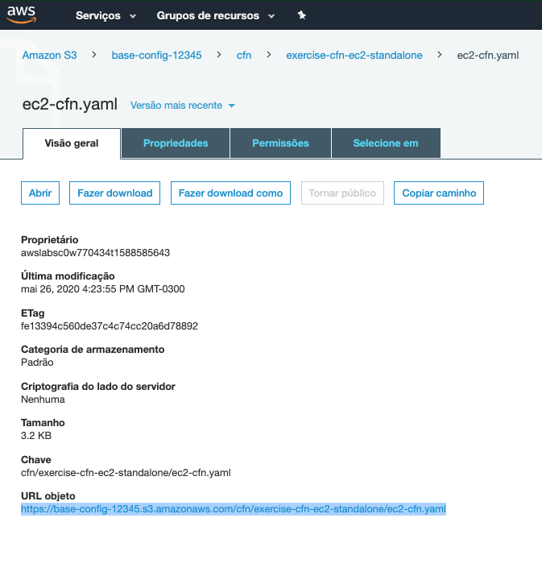
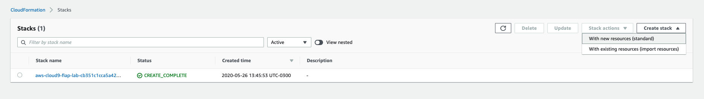
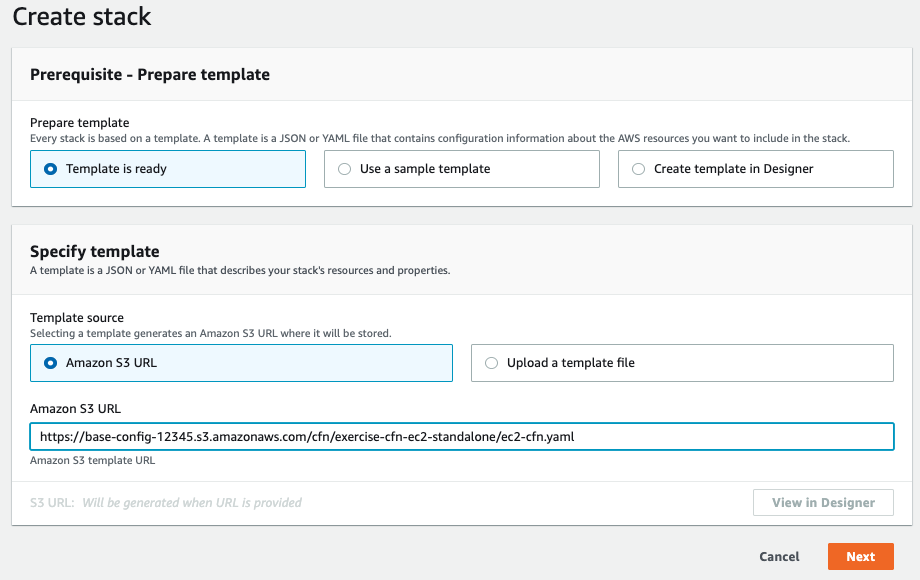
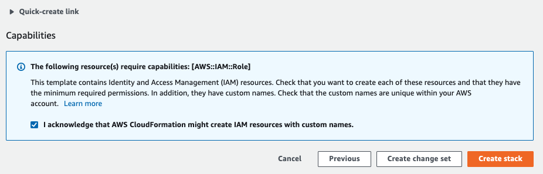
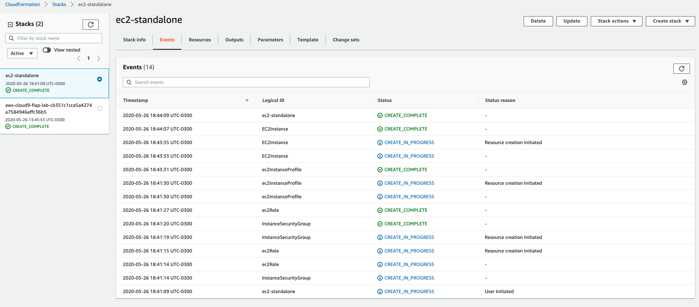
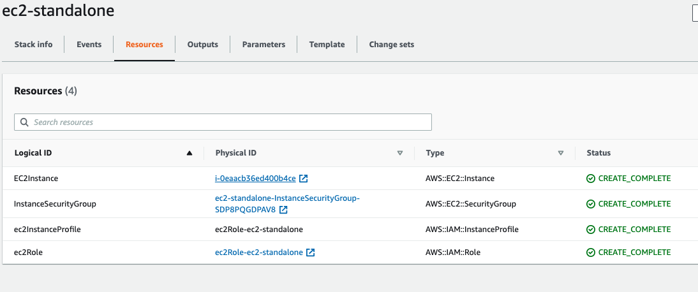
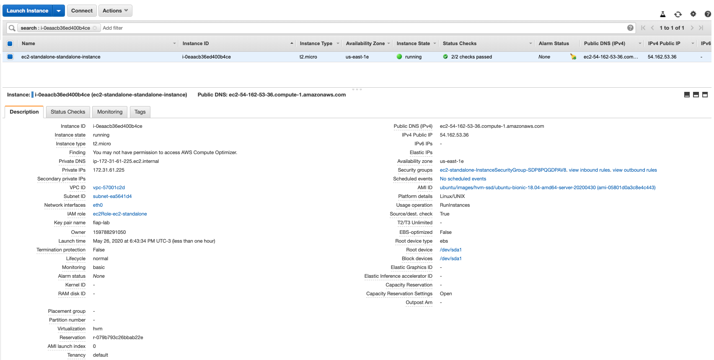
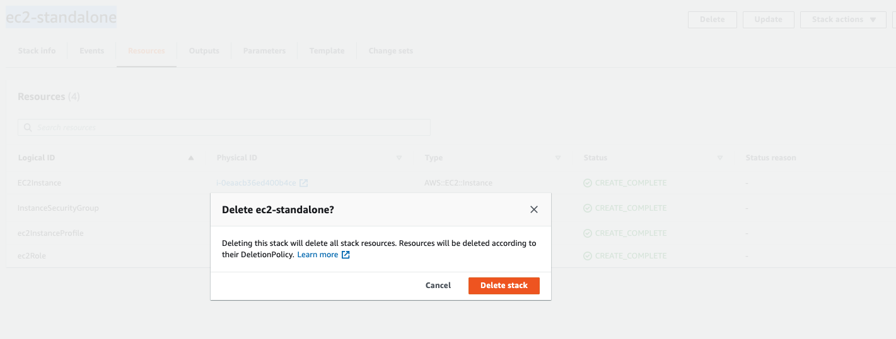
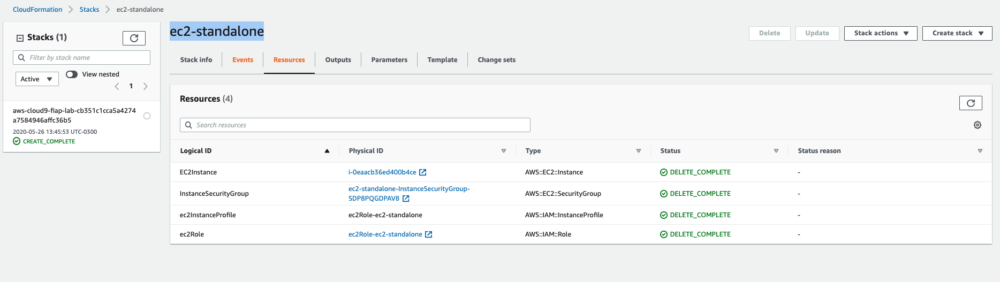

## Cloudformation 1.1 - EC2 Standalone

1. No terminal do cloud9 volte a pasta principal com o comando `cd ~/environment/`
2. Baixe o repositório do exercicio. Para tal, execute o comando `git clone https://github.com/vamperst/exercise-cfn-ec2-standalone.git`
3. Rode o comando `cd exercise-cfn-ec2-standalone` para entrar na pasta do exercicio
4. Vamos subir o aquivo 'ec2-cfn.yaml' para o S3. Utilize o comando `aws s3 cp ec2-cfn.yaml s3://base-config-<SEU RM>/cfn/exercise-cfn-ec2-standalone/`. Isso é necessário pois o cloudformation trabalha com um link de S3 apontando para o arquivo via console.
5. Em outra aba, va ao console do S3 e entre no seu bucket. Navegue até o seu arquivo (cfn/exercise-cfn-ec2-standalone/ec2-cfn.yaml) e copie a URL do mesmo. Caso não apareça de primeira, atualize a página.
   
6. Abra uma nova aba do navegador e vá para o  serviço `Cloudformation` no console AWS.
7. Do lado superior direito clique em `Create stack` e clique em `With new resources (standart)` no menu que abriu.
   
8. Cole a URL que copiou do S3 no campo `Amazon S3 URL` e clique em next.
   
9. Coloque o nome da Stack de `ec2-standalone` , deixe os campos preenchidos automaticamente como estão. Clique em `Next`.
10. Clique em `Next` na próxima tela.
11. De a autorização para o cloudformation criar IAM com nomes customizados selecionando a opção no final da página. Clique em `Create stack`
    

12. O processo pode demorar alguns minutos pois a criação de um instance profile demora um pouco.
13. Aguarde até que o status fique em `CREATE_COMPLETE`
    
14. Vá até a aba 'Resources' que clique no link com o `Physical ID` da EC2Instance.
    
15. Ao clicar foi aberto o painel do Ec2 criado. Explore o quanto quiser
    
16. De volta ao painel do cloudformation com a stack `ec2-standalone` selecionada clique em `Delete` no superior direito da tela e confirme.
    
17. Após alguns instantes a stack será deletada e não aparecerá mais no menu do lado esquerdo.

