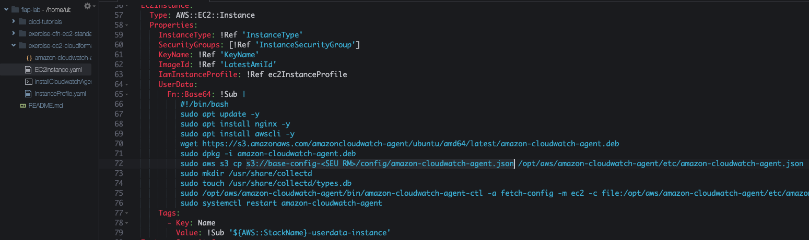
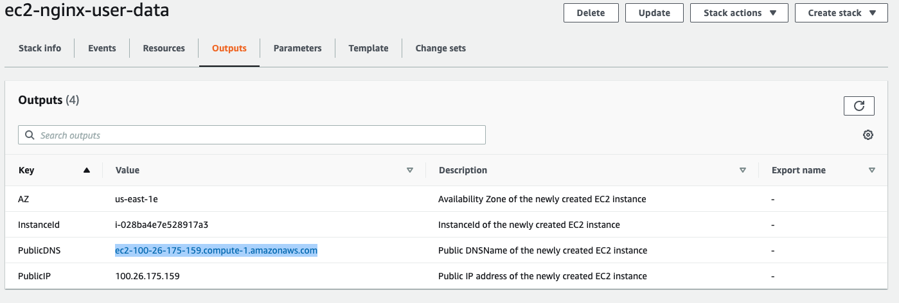
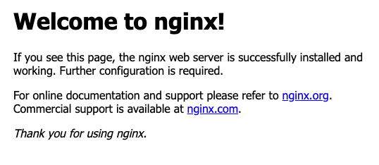
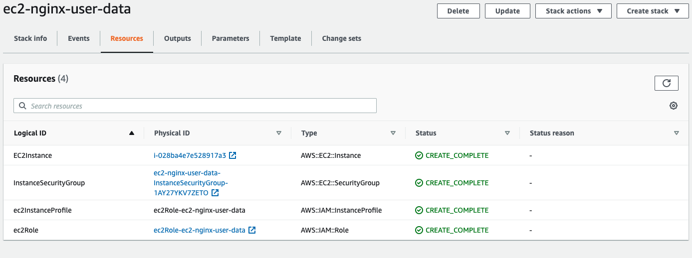
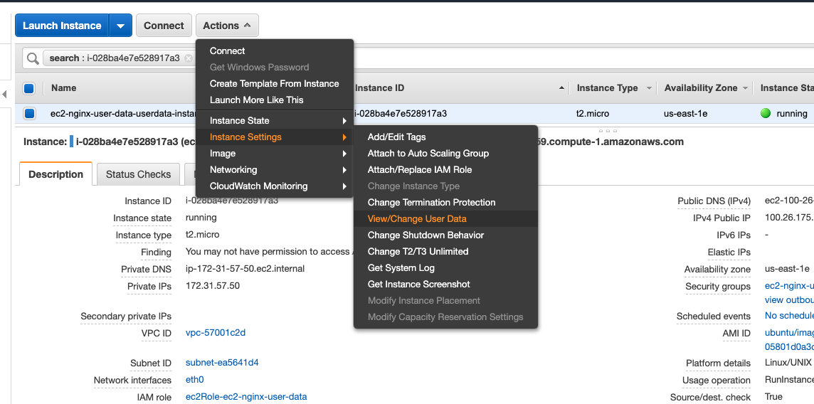
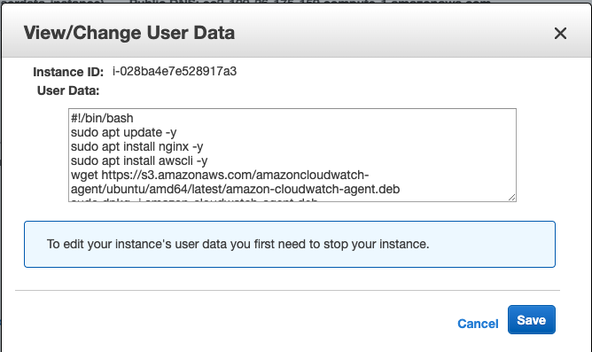
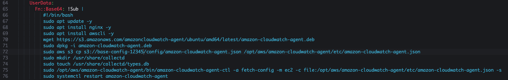

## Cloudformation 1.2 - EC2 Userdata

1. No terminal do cloud9 volte a pasta principal com o comando `cd ~/environment/`
2. Baixe o repositório do exercicio. Para tal, execute o comando `git clone https://github.com/vamperst/exercise-ec2-cloudformation.git`
3. Rode o comando `cd exercise-ec2-cloudformation` para entrar na pasta do exercicio
4. Vamos subir o aquivo 'amazon-cloudwatch-agent.json' para o S3. Utilize o comando `aws s3 cp amazon-cloudwatch-agent.json s3://base-config-<SEU RM>/config/`. Vamos utilizar esse arquivo no nosso script de user-data
5. No IDE do cloud9 vá até o arquivo EC2Instance.yaml que esta no caminho fiap-lab/exercise-ec2-cloudformation/
6. Na linha 72 altere a parte <SEU RM> ajustando o nome do bucket para o que você criou no setup. Não esqueça de salvar com control+S. Caso tenha uma bolinha ao lado da aba do arquivo no IDE ele não esta salvo.
   
7. Agora vamos subir o arquivo para o S3 com o comando `aws s3 cp EC2Instance.yaml s3://base-config-<SEU RM>/cfn/exercise-ec2-cloudformation/`
8. Vá até o S3 e pegue a URL do arquivo que acabou de subir e utilize para criar uma stack no cloudformation como fez no exercicio anterior, porém agora o nome da stack é `ec2-nginx-user-data`
9. Após a criaçao da Stack. Vá até a aba `Outputs` e clique no PublicDNS.
    
10. Uma tela do Nginx irá aparecer:
    
11. Para entender como isso aconteceu. Na aba de `Resources` clique no ID da instancia criado para abrir o painel EC2.
    
12. Com a instância selecionada clique em 'Actions'no topo da página. Selecione `Instance Settings` e clique em `View/Change User Data`
    
13. Esse script que apareceu roda quando a instância é iniciada.
    
14. Se forem no IDE no arquivo EC2Instance.yaml que alterou, verá entre as linhas 66 e 76 que o script estava direto no códido do cloudformation.
    
15. Após explorar o que quiser. Delete a stack `ec2-nginx-user-data` do cloudformation.

