## Cloudformation 1.3 - Custom Resources

1. No terminal do cloud9 volte a pasta principal com o comando `cd ~/environment/`
2. Baixe o repositório do exercicio. Para tal, execute o comando `git clone https://github.com/vamperst/exercise-features-cloudformation.git` . Este é o repositório que utilizará no restante do módulo Cloudformaiton.
3. Rode o comando `cd exercise-features-cloudformation` para entrar na pasta do exercicio.
4. Execute o comando `cd 01-custom-resources/`
5. Em uma nova aba vá para o serviço `IAM` 
6. No menu lateral esquerdo clique em `Políticas` e clique no botão `Criar política` no canto supeiror direito
   
7. Copie o conteúdo do arquivo `lambda_policy.yaml` que esta no caminho `fiap-lab/exercise-features-cloudformation/01-custom-resources` do IDE cloud9
   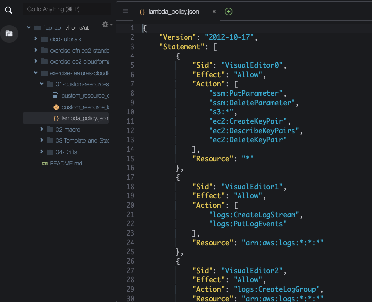
8. De volta a aba do IAM clique na aba Json e cole a política
   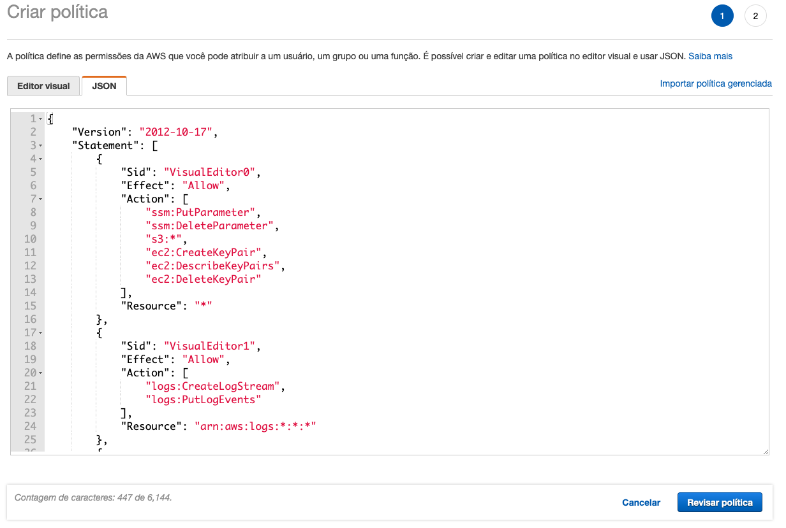    
9. Clique em `Revisar política`
10. De o nome `lambda-policy-custom-resources` para a política e clique em `Criar política` no canto inferior direito
    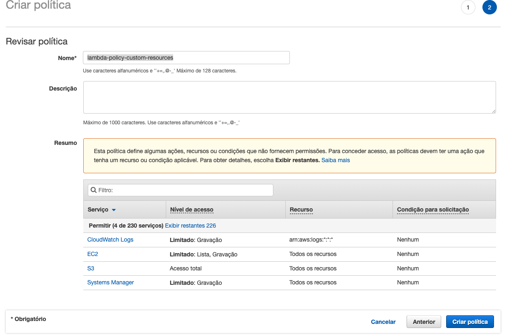
11. No menu lateral esquerdo do IAM clique em `Funções`
12. Clique em `Criar função`
13. Clique em cima de `Lambda` para criarmos uma função para o serviço Lambda
    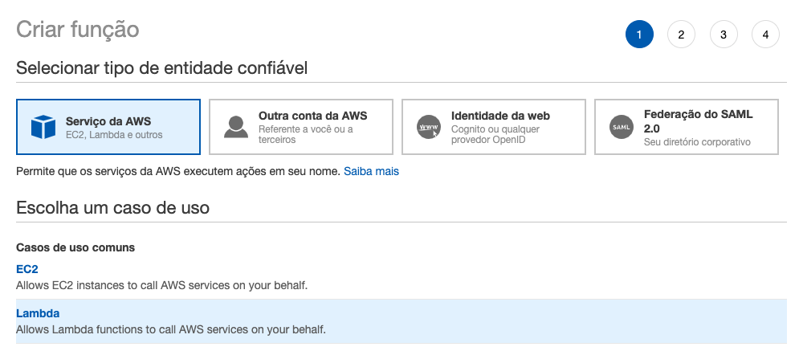
14. Clique em `Próximo: Permissões` no canto inferior direito
15. Pesquise e selecione a função que criou nos passos anteriores
    
16. Avance até a tela de revisão
17. De o nome de `lambda-role-custom-resources` e clique em `Criar função`
    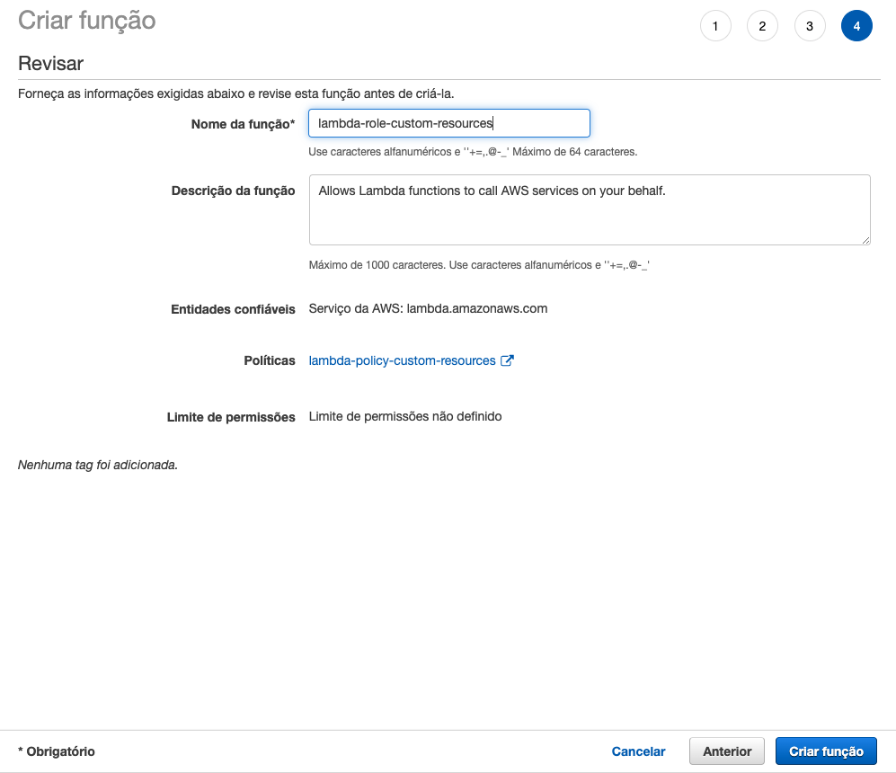
18. Em uma nova aba vá para o console do `Lambda`
19. No canto direito superior clique em `Criar Função`
   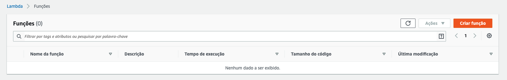
20. De o nome de `ssh-key-gen` a função Lambda. Escolha a linguagem `Python 3.6` e a função IAM `lambda-role-custom-resources` que acabou de criar.
    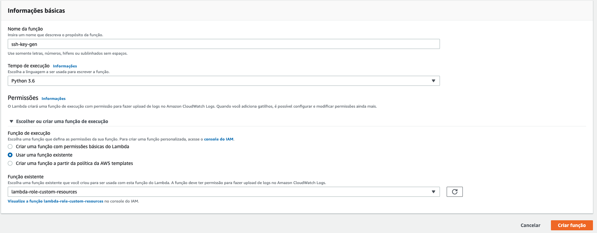    
21. Clique em `Criar função`
22. Copie o conteudo do arquivo `custom_resource_lambda.py` que esta no caminho `fiap-lab/exercise-features-cloudformation/01-custom-resources` do IDE cloud9.
    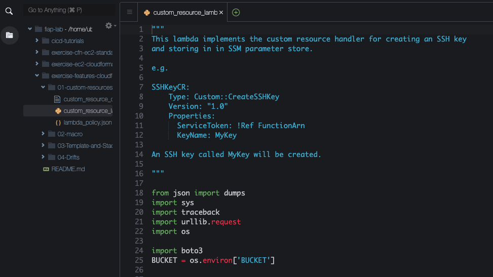
23. Cole o código no IDE na aba da função lambda que acabou criar
    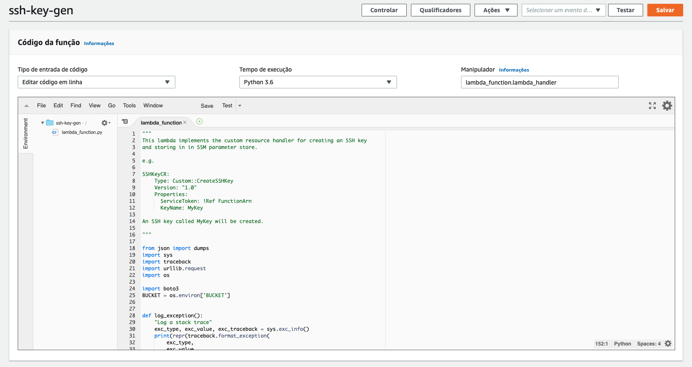
24. No campo `Variáveis de ambiente` clique em `Gerenciar variáveis de ambiente`
25. Clique em `Adicionar variáveis de ambiente`
26. Adicione a chave `BUCKET` e o valor `base-config-<SEU RM>` e clique em salvar
    
27. Clique em `Salvar` no canto superior direito.
28. De volta ao terminal do cloud9 execute o comando `aws s3 cp custom_resource_cfn.yml s3://base-config-<SEU RM>/cfn/exercise-features-cloudformation/` para colocar o template do cloudformaiton no S3.
29. Abra uma aba para o `Cloudformation` e clique em `Create stack`
30. Copie a URL do S3 do arquivo `custom_resource_cfn.yml` que acabou de subir, cole no campo `Amazon S3 URL` e clique em next
31. De o nome de `custom-resources-ssh-ec2` a stack.
32. Na aba da função lambda `ssh-key-gen` copie o ARN dela. Esta no canto superior direito da página.
    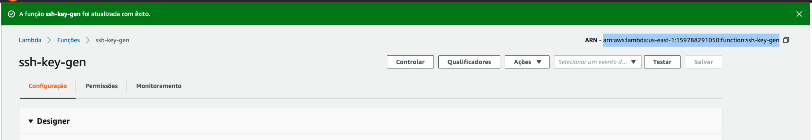
33. Cole no campo `FunctionARN` na criação da stack. 
34. Selecione uma VPC e uma Subnet
    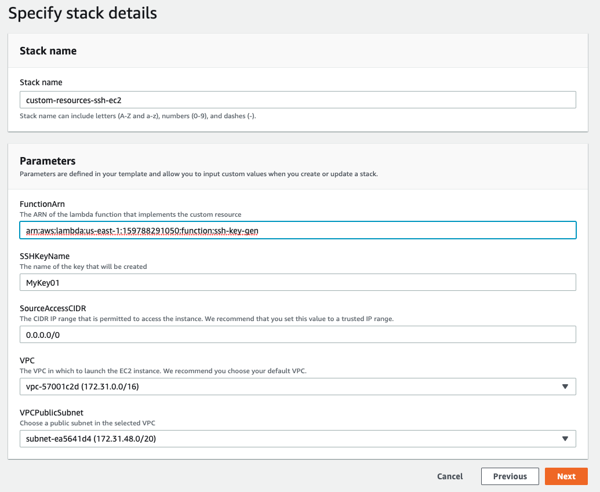
35. Avance e crie a stack
36. Após a criação com sucesso da stack foi criado uma instância e uma chave PEM que foi guardada no S3 em `base-config-<SEU RM>/pem/MyKey01.pem`
    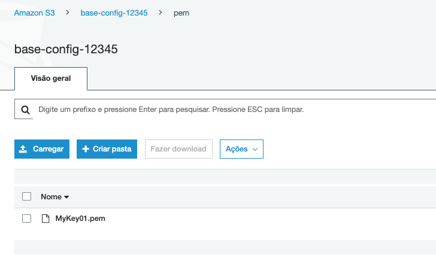
37. A chave foi criada pela função lambda chamada pelo cloudformation como custom resource.
38. Delete a stack após olhar tudo que desejava.