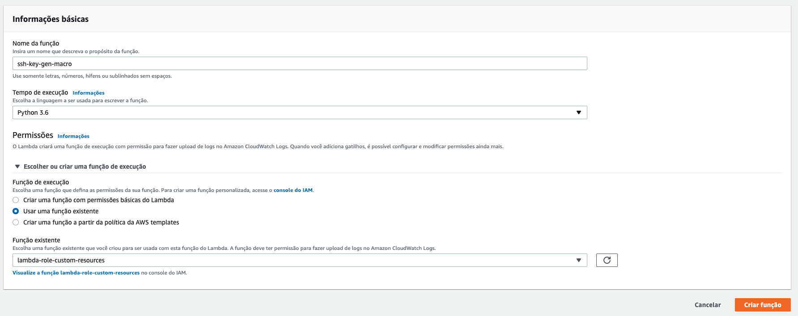
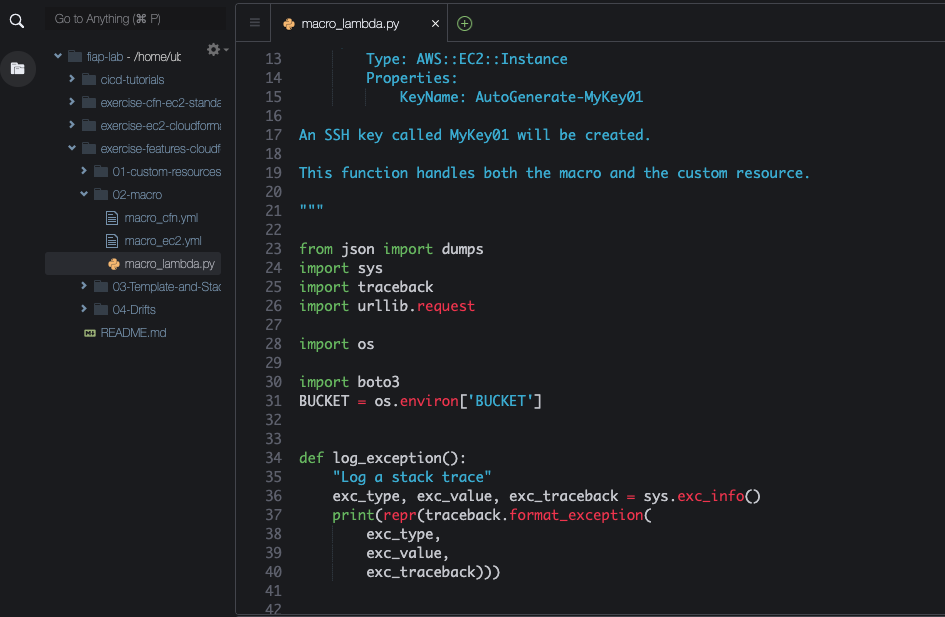
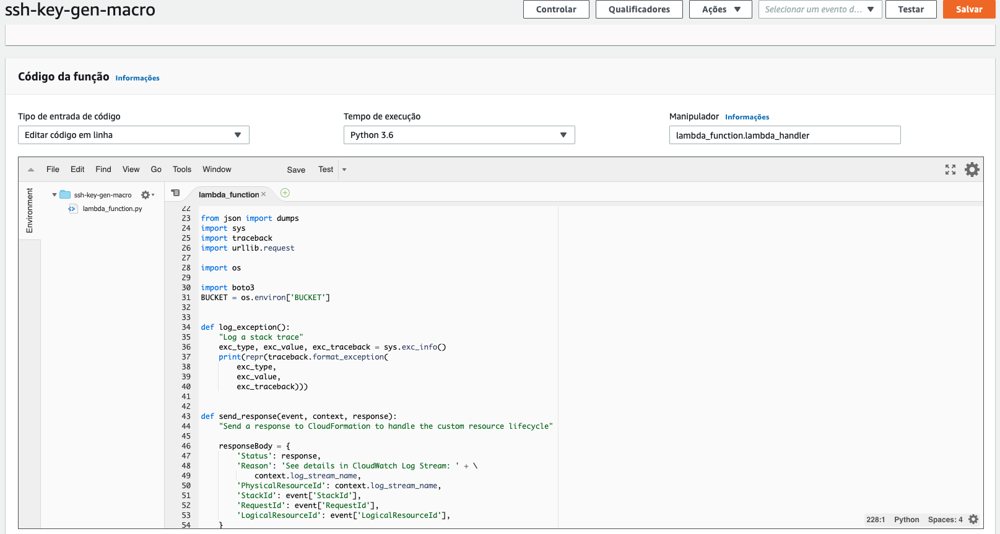
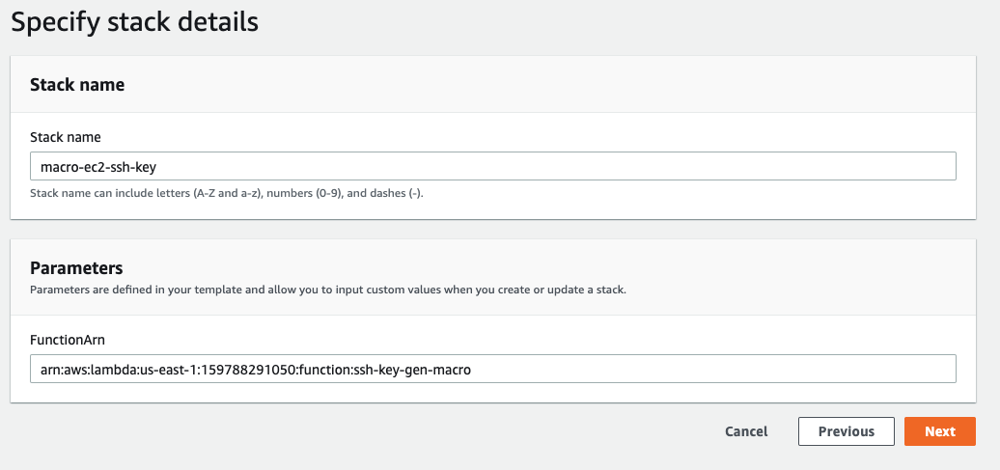
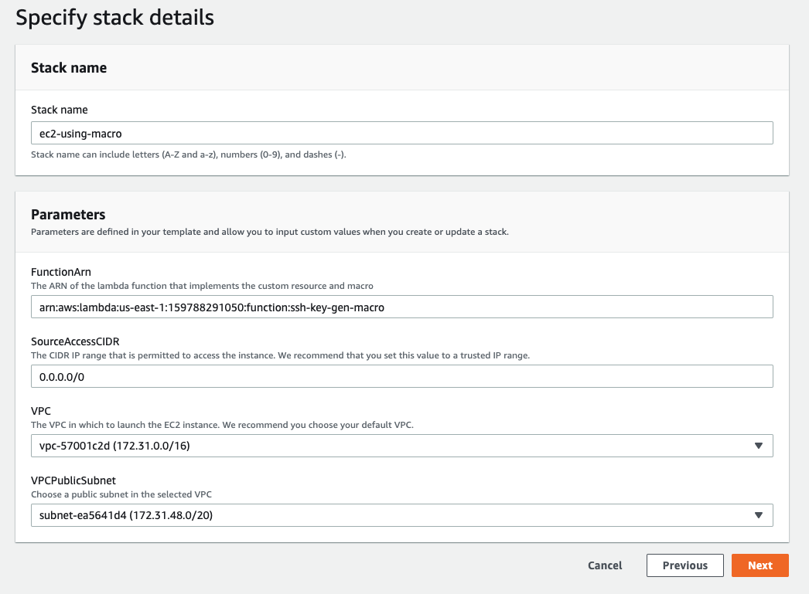

## Cloudformation 1.4 - Macros

1. Rode o comando `cd ~/environment/exercise-features-cloudformation/02-macro/` para entrar na pasta do exercicio.
2. Execute os comandos abaixo para colocar os 2 templates necessários para o exercicio no S3:
   ``` shell
    aws s3 cp macro_cfn.yml s3://base-config-<SEU RM>/cfn/exercise-features-cloudformation/ 
    
    aws s3 cp macro_ec2.yml s3://base-config-<SEU RM>/cfn/exercise-features-cloudformation/
   ```
3. Abra uma aba do console AWS no serviço Lambda e clique em `Criar função`
4. De o Nome de `ssh-key-gen-macro` a função lambda
5. Escolha a linguagem `Python 3.6` e a Permissão IAM `lambda-role-custom-resources ` criada no exercício anterior.
   
6. Clique em `Criar função`
7. Copie o conteudo do arquivo `macro_lambda.py` no caminho `fiap-lab/exercise-features-cloudformation/02-macro` do IDE cloud9
   
8. Cole o conteudo copiado no IDE da função Lambda récem criada.
   
9.  No campo `Variáveis de ambiente` clique em `Gerenciar variáveis de ambiente`
10. Clique em `Adicionar variáveis de ambiente`
11. Adicione a chave `BUCKET` e o valor `base-config-<SEU RM>` e clique em salvar
    
12. Clique em `Salvar` no canto superior direito.
13. Na aba do cloudformation, crie uma stack utlizando o arquivo `macro_cfn.yml` que subiu no S3. De o nome da stack de `macro-ec2-ssh-key` e copie o ARN da récem criada função lambda para colar no campo FunctionArn
    
14. Agora crie uma stack com o arquivo `macro_ec2.yml` que esta no S3
15. De o nome de `ec2-using-macro`
16. Copie e cole o ARN da função lambda récem criada, escolha a VPC e subnet
    
17. Avance e crie.
18. Dessa vez não foi preciso adicionar o custon resources direto no código que subiu a EC2. A macro criada capta o valor da key que consta Auto-Generate e adiciona o código da Macro com o custom resources e a chave é criada.
19. Delete a Stack
    