## Cloudformation 1.5 - Drift Detection

1. Rode o comando `cd ~/environment/exercise-features-cloudformation/03-Drifts/` para entrar na pasta do exercício.
2. Execute o comando abaixo para colocar o template necessário para o exercicio no S3:
   ``` shell
    aws s3 cp drift_detection_stack.yml s3://base-config-<SEU RM>/cfn/exercise-features-cloudformation/ 
   ```
3. Crie uma stack com o nome `drift-lab-with-sqs` utilizando o arquivo `drift_detection_stack.yml` que acabou de subir para o S3.
4. Após criado, note que na aba `Stack Info` a opção `Drift Status` está `NOT_CHECKED`
   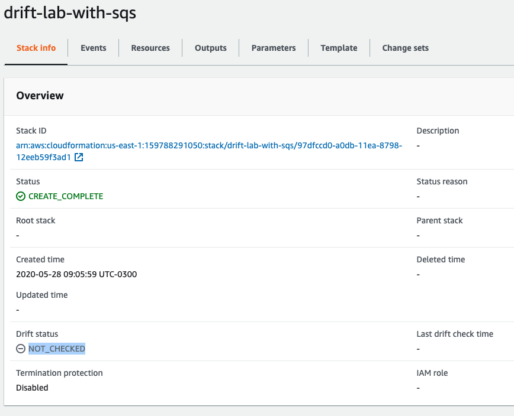
5. No canto superior direito clique em `Stack actions` e clique em `Detect drift`
   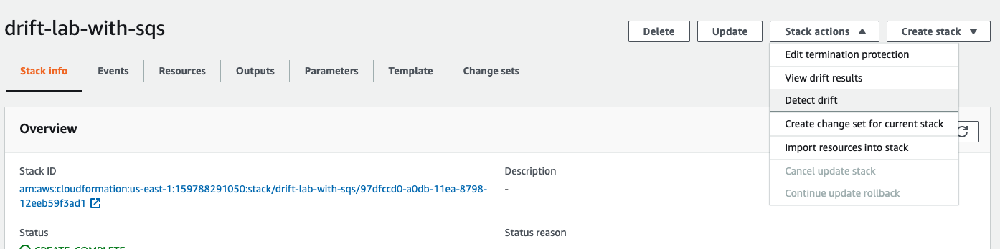
6. Note que após alguns instantes o Drift Status muda para `IN_SYNC`
   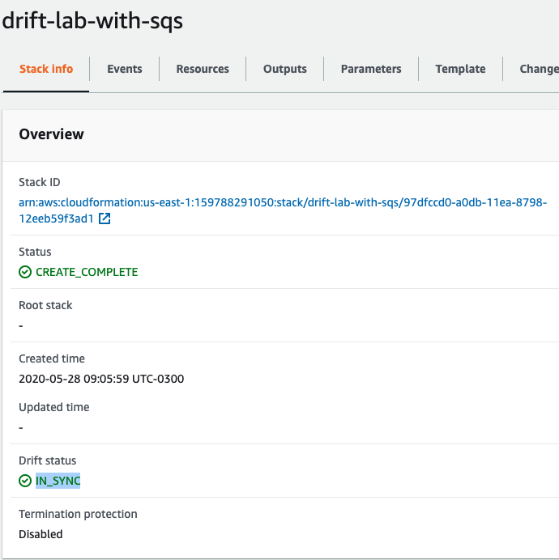
7. Em uma nova aba do console AWS vá para o serviço SQS (Simple queue Service)
8. Note que o cloudformation que subiu criou 2 filas `DriftLab-ErrorQueue` e `DriftLab-InputQueue`
   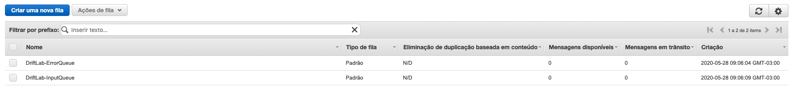
9. Selecione a `DriftLab-InputQueue` e clique em `Ações de fila` e clique em `configurar fila` 
    
10. Coloque os seguintes parametros:
    1.  `Tempo limite de visibilidade` padrão = 50 segundos
    2.  `Atraso de entrega` = 120 segundos
    3.  Tire a seleção do checkbox `Usar a política de redirecionamento`
   Clique em Salvar alterações.
   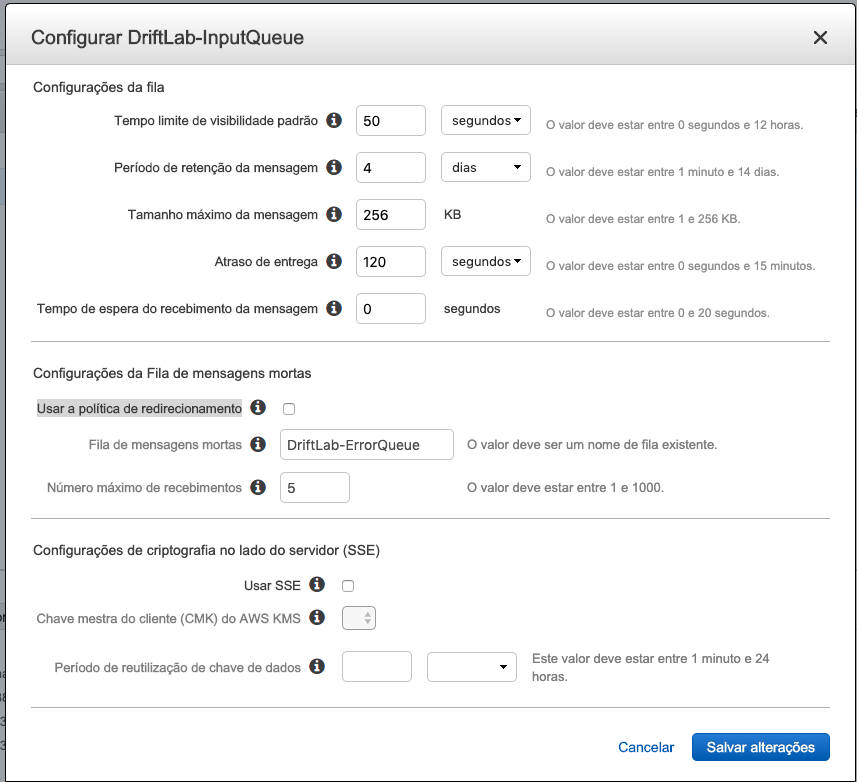
11. Você mudou o valor de uma propriedade existente no template cloudformation que fez deploy.
12. Volte a aba do cloudformation e clique novamente em `Detect Drift`. Note que dessa vez o valor ficará como `DRIFTED`
    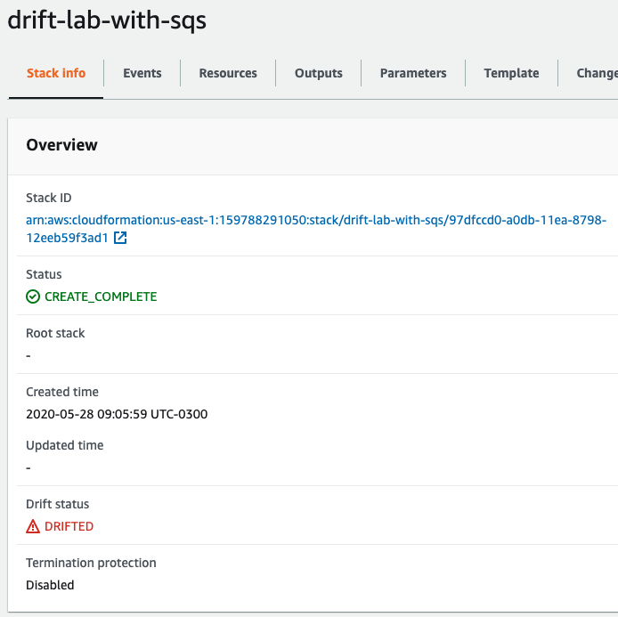
13. Para verificar o que mudou vá até `Stack options` no canto direito superior e clique em `View drift results`
    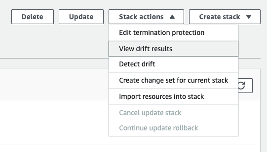
14. Essa tela vai mostrar por resurso criado o que foi modificado e o que esta correto segundo o template utilizado.
    
15. Selecione o recurso `InputQueue` e clique em `View drift details`
16. Note que nessa tela você consegue ver o que foi modificado e removido baseado no template original
    
17. Uma opção para remediar é colocar os valores corretos manualmente de volta nos recursos. Vá nas configurações da fila SQS e coloque os seguintes valores.
    1.  `Tempo limite de visibilidade padrão` = 30 segundos
    2.  Selecione o checkbox `Usar a política de redirecionamento`
    3.  `Fila de mensagens mortas` = DriftLab-ErrorQueue
    4.  `Número máximo de recebimentos` = 5
   Clique em `Salvar alterações`
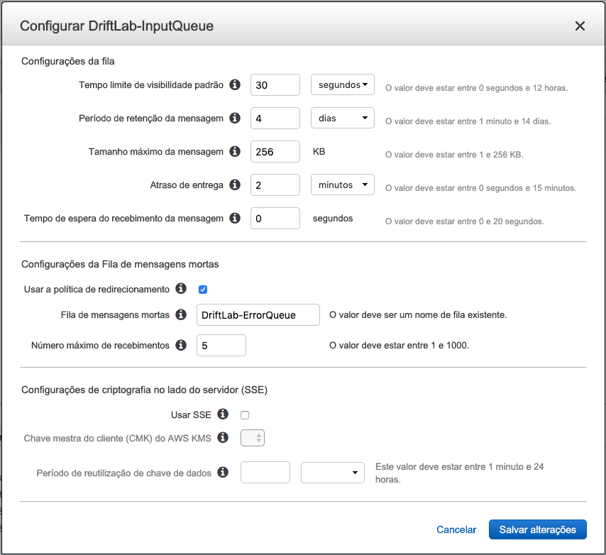
18. Devolta a tela do cloudformation nos drift details clique em `Detect drift for resource` no canto superior direito.
19. Note que um dos alarmes sumiu por que alteramos os paramentros manualmente.
    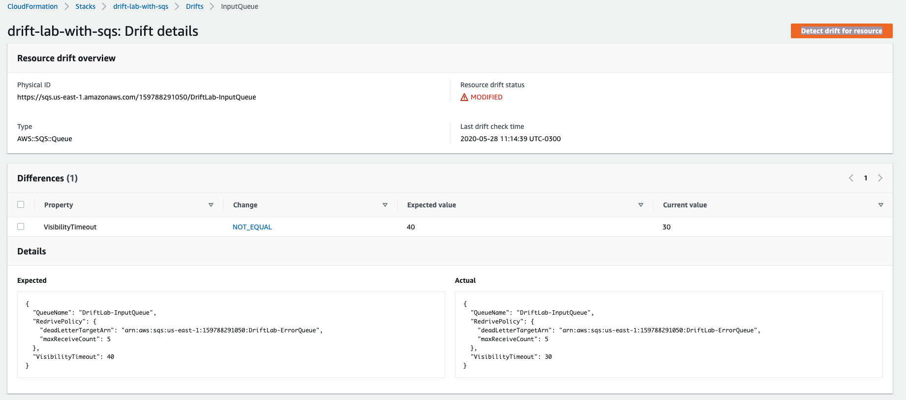
20. Outra maneira de tirar os alarmes é sobrescrevendo os parametros no template. Para isso no IDE do Cloud9 abra o arquivo `drift_detection_stack.yml` que exta no caminho `fiap-lab/exercise-features-cloudformation/03-Drifts`
21. Altere o valor do campo `VisibilityTimeout` pra `70` e salve.
    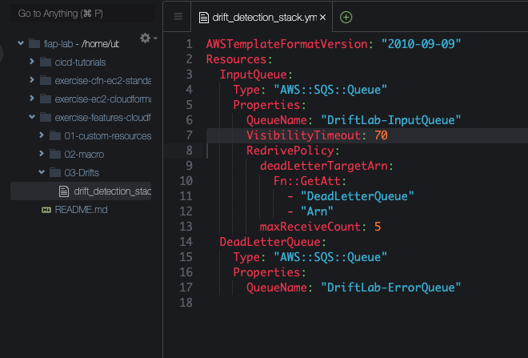
22. Na linha de comando utilize novamente o comando `aws s3 cp drift_detection_stack.yml s3://base-config-<SEU RM>/cfn/exercise-features-cloudformation/` para atualizar o template do S3
23. Na aba do cloudformation na visão geral da stack `drift-lab-with-sqs` clique no botão update no canto superior direito.
    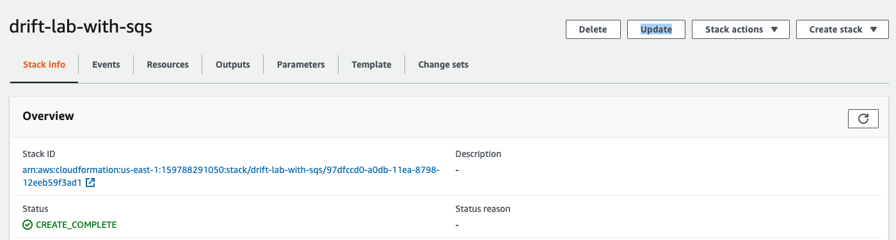
24. Selecione `Replace current template` e cole novamente a URL do arquivo drift_detection_stack.yml que está no S3.
    
25. Clique nos Next até na ultima página clique em `Update stack`
    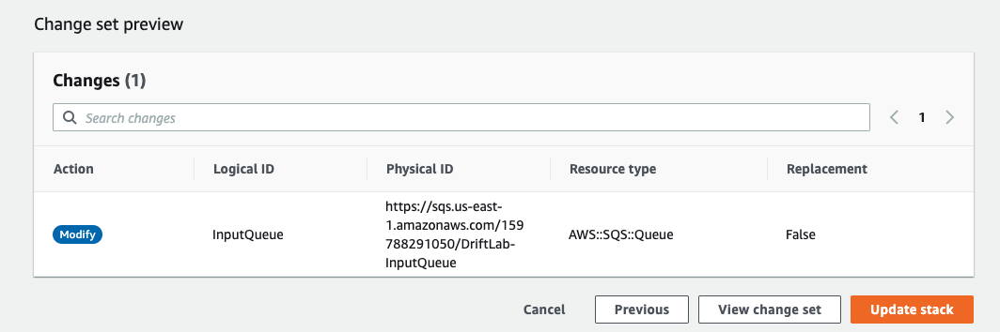
26. Após o termino do update o Drift Status volta para `NOT_CHECKED`. Clique em `Stack actions` e selecione `Detect Drift`
27. Note que agora fica como `IN_SYNC`. 
28. Delete a stack