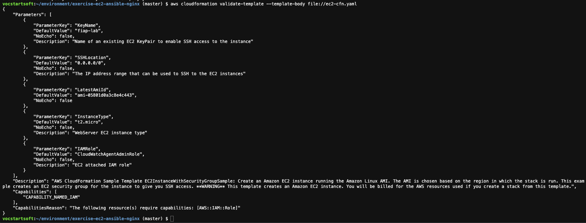
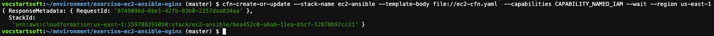
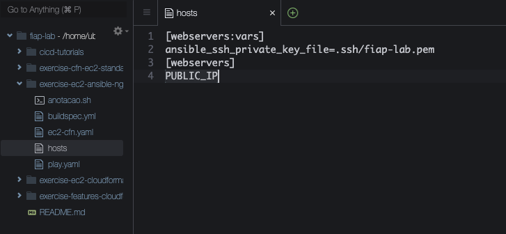
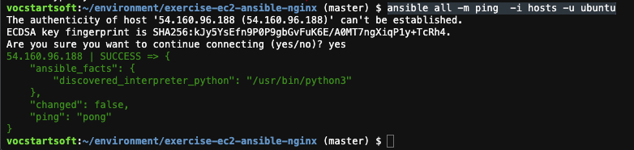
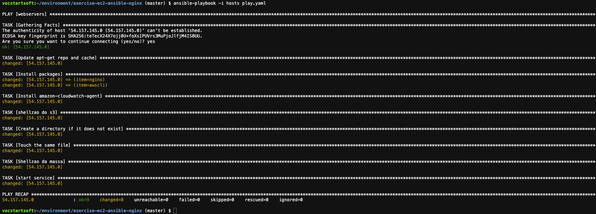
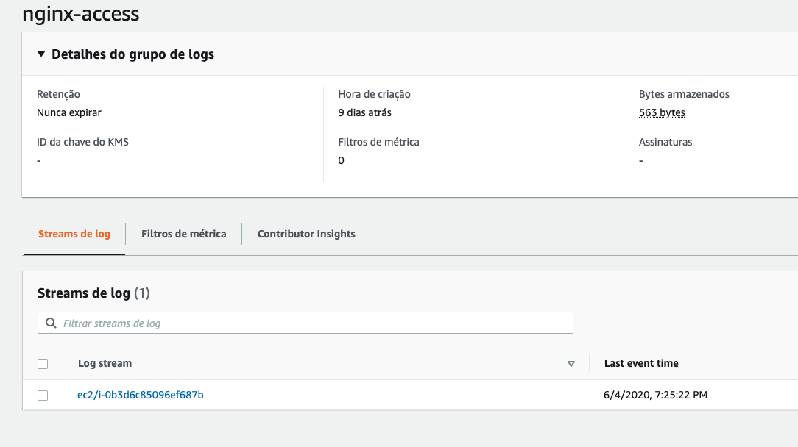
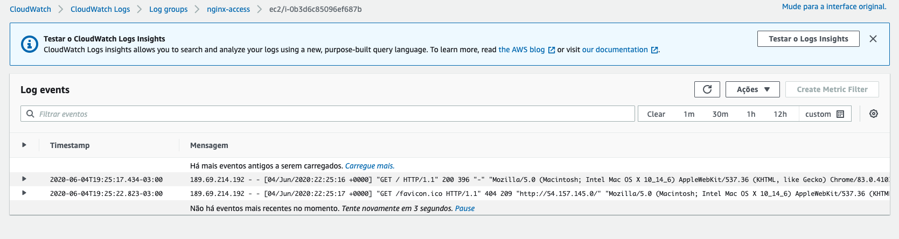

## Gerenciamento de configuração 2.0 - Ansible

1. Execute o comando `cd ~/environment/` para voltar a pasta padrão do Cloud9.
2. Clone o repositório do exercicio com o seguinte comando `git clone https://github.com/vamperst/exercise-ec2-ansible-nginx.git`
3. Entre na pasta do exercício com `cd exercise-ec2-ansible-nginx`
4. Primeiramente vamos validar o template cloudformation e quais permissões ele precisa com o comando `aws cloudformation validate-template --template-body file://ec2-cfn.yaml`
   
5. Para ser executado o template precisa da permissão CAPABILITY_NAMED_IAM. Então para executar o template utilize o comando `cfn-create-or-update --stack-name ec2-ansible --template-body file://ec2-cfn.yaml  --capabilities CAPABILITY_NAMED_IAM --wait --region us-east-1`. O comando levará um tempo para executar e enquanto isso o terminal ficará travado. Caso queira pode acompanhar pelo painel do cloudformation.
   
6. Para ter acesso ao ip publico da instância criada execute o comando `aws cloudformation describe-stacks --stack-name ec2-ansible --query "Stacks[0].Outputs[?OutputKey=='PublicIP'].OutputValue" --output text`. Esse comando já esta fazendo o filtro no Json para devolver apenas a informação desejada. Caso queira ver o json de retorno completo utilize o comando `aws cloudformation describe-stacks --stack-name ec2-ansible`. Copie o ip publico da instancia.
7. No IDE do cloud9 abra o arquivo `hosts` para o caminho `fiap-lab/exercise-ec2-ansible-nginx` , altere a linha 4 colocando o ip publico copoado e salve.
   
8. Para checar se o ansible esta conseguindo acessar a maquina utilize o comando `ansible all -m ping  -i hosts -u ubuntu` e no prompt coloque 'yes'
   
9. No IDE do cloud9 abra o arquivo `play.yaml` que esta no caminho  `fiap-lab/exercise-ec2-ansible-nginx` e altere o nome do bucket S3 para o que criou.
    
10. Vamos executar o ansible playbook com o comando `ansible-playbook -i hosts play.yaml`. Esse playbook vai instalar o nginx e configurar para enviar os logs do server para o cloudwatch logs.
    
11. Para testar o funcionamento copie o ip publico da maquina em que a instalação foi feita e cole no navegador. Deverá abrir a página de boas vindas do nginx.
12. Para acessar os logs no cloudwatch abra o seguinte link em uma nova aba https://console.aws.amazon.com/cloudwatch/home?region=us-east-1#logsV2:log-groups/log-group/nginx-access
13. Clique no link com ec2/instance-id 
    
14. Nessa tela é possivel ver os logs de acesso do nginx. Para testar é só abrir a pagina de nginx do passo 11 no mesmo navegador ou em outros e ver que novos logs aparecem.
    
15. Para destruir a stack criada volte ao terminal do cloud9 e utilize o comando `aws cloudformation delete-stack --stack-name ec2-ansible`
16. É possivel acompanhar a deleção via console do cloudformation caso deseje.
