## CICD 3.3 - Cloudformation - EC2-Ansible

1. Execute o comando `cd ~/environment` para voltar ao diretório principal.
2. Em outra aba do navegador faça o fork para sua conta do github do repositório <https://github.com/vamperst/exercise-ec2-ansible-nginx>
3. De volta ao terminal do cloud9 apague o projeto do repositório que acabou de fazer fork e baixe o da sua conta com os comandos abaixo. Não esqueça de adicionar seu login do github ao segundo comando:
   ``` shell
   rm -rf ~/environment/exercise-ec2-ansible-nginx
   git clone https://github.com/<SEU LOGIN NO GITHUB>/exercise-ec2-ansible-nginx.git
   ```
4. Entre na pasta com o comando `cd exercise-ec2-ansible-nginx`
5.  No IDE do Cloud9 abra o arquivo `play.yaml` que esta no caminho `fiap-lab/exercise-ec2-ansible-nginx`
6.  Na linha 25 coloque o seu RM no bucket para acertar o nome do bucket que criou no setup e configuração.
   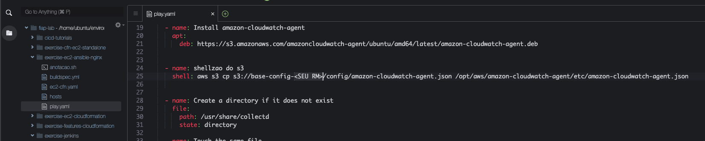
7. Devolta a linha de comando execute os comandos abaixo para fazer o commit do código para o seu github e estar tudo preparado para que o pipeline não execute com erro.
    ``` shell
    git add play.yaml
    git commit -m "preparando para pipeline"
    git push origin master
    ```
8. Em outra aba do navegador entre no serviço `CodePipeline` do console AWS.
9.  Clique em `Criar pipeline` no canto supersiror direito
10. De o nome de `cicd-ec2-ansible` ao pipeline e clique em `Próximo`
11. Conecte o github como origem e escolha o repositório `exercise-ec2-ansible-nginx` que acabou de fazer fork para sua conta no ramo master e clique em `Próximo`
   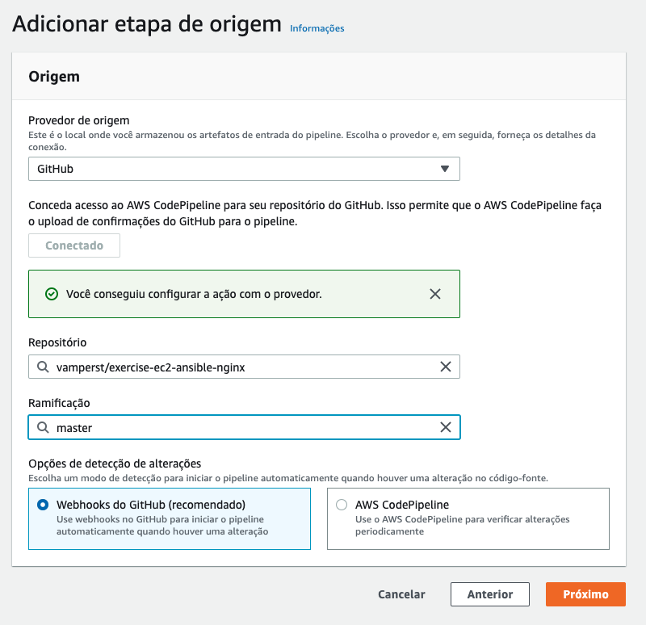

11. Em compilação ignore a etapa de compilação. Vamos fazer customizado após a criação.
12. Em implantação escolha `AWS Cloudformation` e deixe as opções da seguinte maneira:
    1.  Modo de ação = Criar ou atualizar uma pilha
    2.  Nome da pilha = cicd-ec2-ansible
    3.  Nome do artefato = sourceArtifact
    4.  Nome do arquivo = ec2-cfn.yaml
    5.  Capacidades = CAPABILITY_IAM E CAPABILITY_NAMED_IAM
    6.  Nome da função = cfn-admin-fiap

    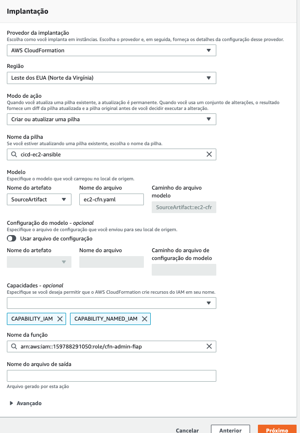

13. Clique em `Próximo` e `Criar Pipeline`
14. Assim que voltar a tela do pipeline criado, clique em `Interromper execução`, selecione a execução no `Selecionar execução` e clique em interromper. 
    
    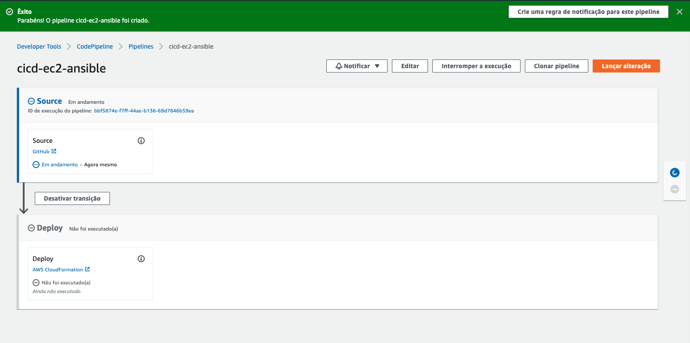
    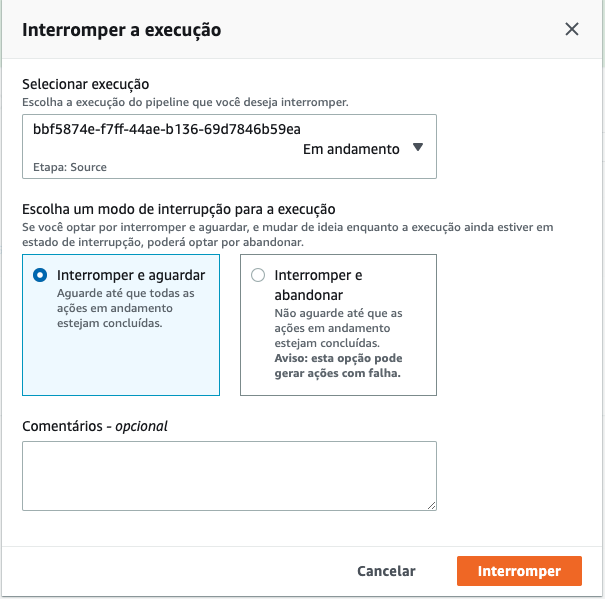

15. Fizemos isso porque vamos editar as etapas adicionando um CodeBuild para executar o ansible após a criação da maquina. Para iniciar, clique em `Editar` no topo direito central da págína do pipeline.
16. Abaixo da etapa Deploy clique em `+ Adicionar etapa` e de o nome de `apply-ansible` a etapa.
    
    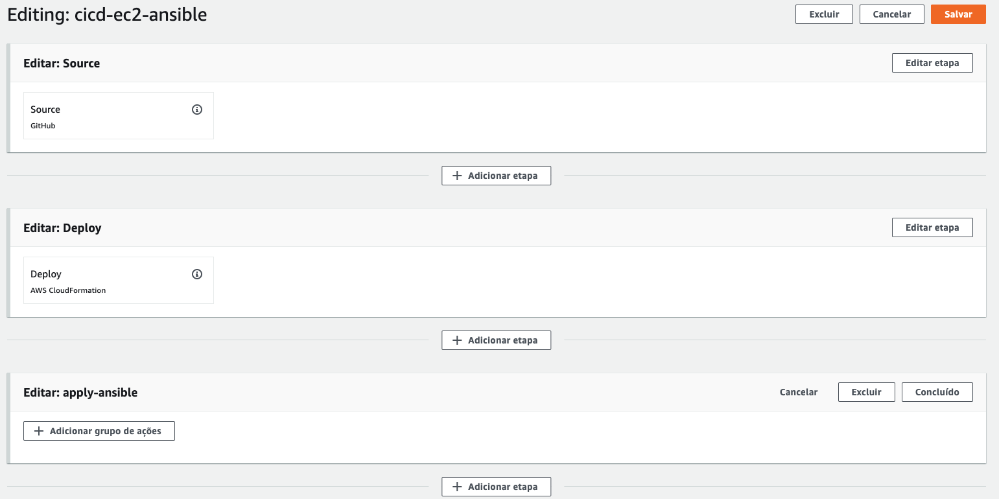

17. Clique em `+ Adicionar grupo de ações` da etapa apply-ansible.
18. Preencha os campos da seguinte maneira:
    1. Nome da ação = Apply-ansible
    2. Provedor de ação = AWS CodeBuild
    3. Artefatos de entrada = SourceArtifact
    4. Variavel de ambiente:
       1. Nome = BUCKET
       2. Valor =  base-config-<SEU RM>
 
 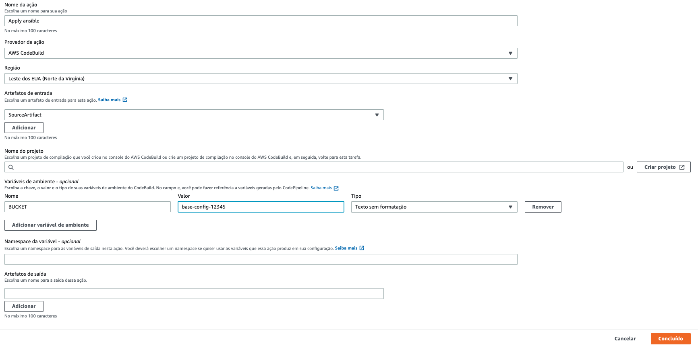

17. Clique no botão `Criar projeto` e uma nova janela irá abrir para criar o projeto do CodeBuild
    
    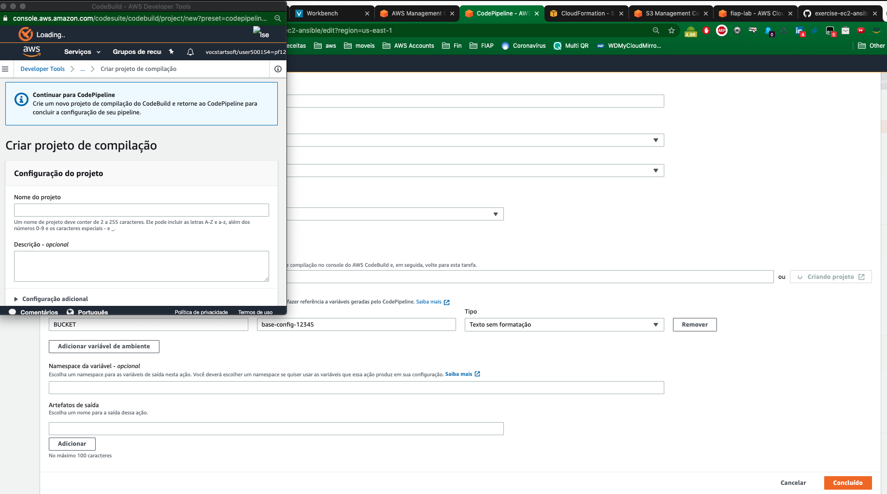
18. Na Janela que abriu coloque as seguintes configurações:
    1. Nome do projeto = build_cicd 
    2. Sistema operacional = ubuntu
    3. Tempo(s) de execução = Standart
    4. Imagem = standart:4.0
    5. ARN da função = codebuild-service-role-fiap
    6. Permitir que o AWS CodeBuild modifique... = não checado 
    7. Privilegiado = Checado
    8. Nome do buildspec = buildspec.yml

    ![](img/code-name.png
    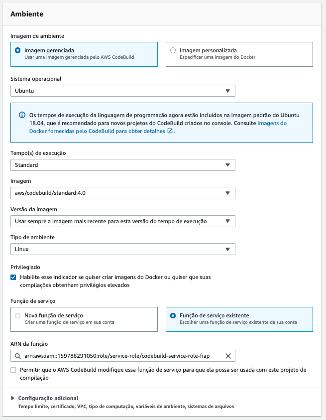
    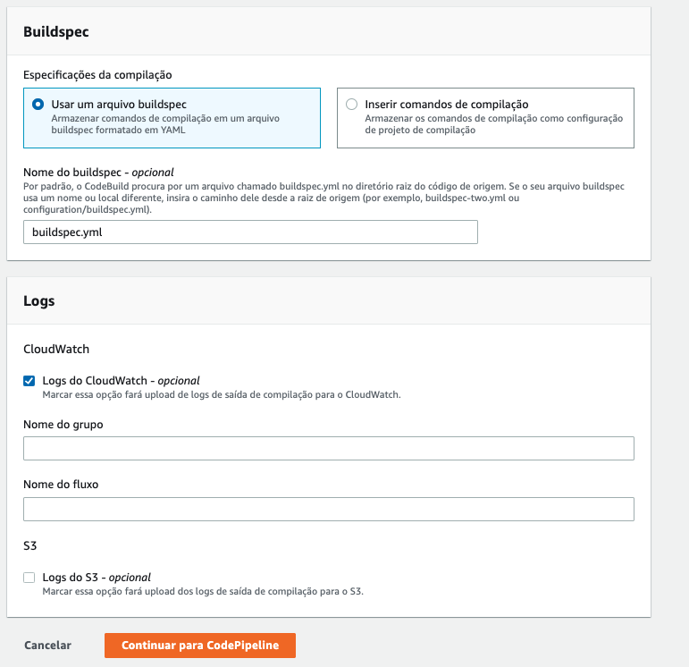

19. Clique em `Continuar para CodePipeline` para criar o codeBuild e voltar ao code pipeline. Note que o campo projeto agora está preenchido. Se atente se a variavel de ambiente não foi apagada. Caso sim, recrie.
    
    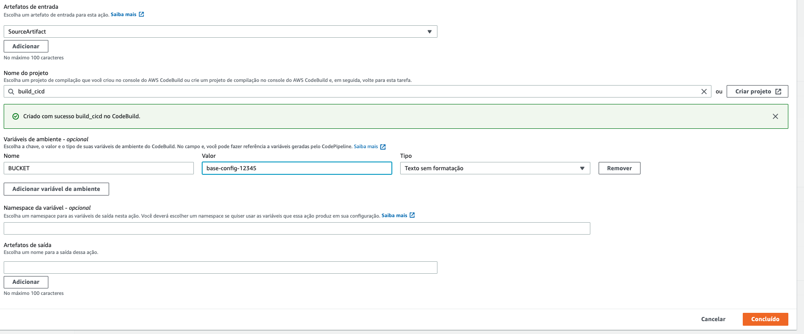

20. Clique em `Concluído`.
21. Salve as alterações no canto superior direito
    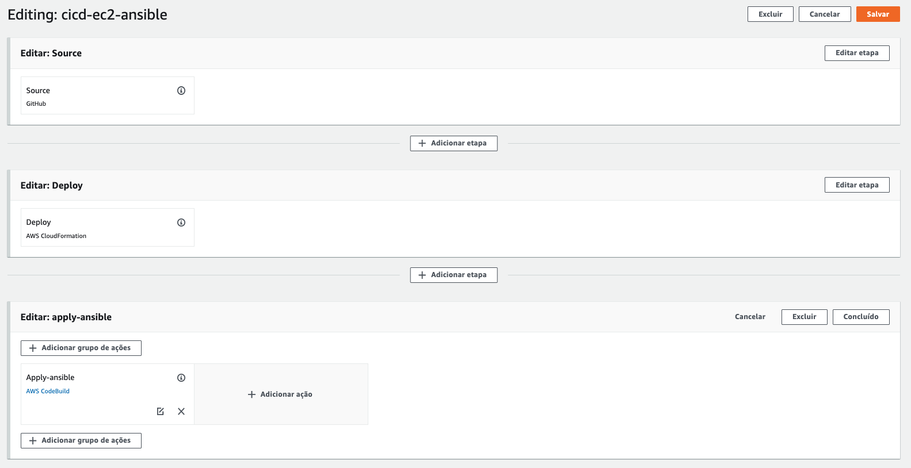
22. Clique em `Lançar alteração` no canto superior direito para executar o pipeline.
23. Quando chegar na etapa do Ansible clique em `detalhes`.
    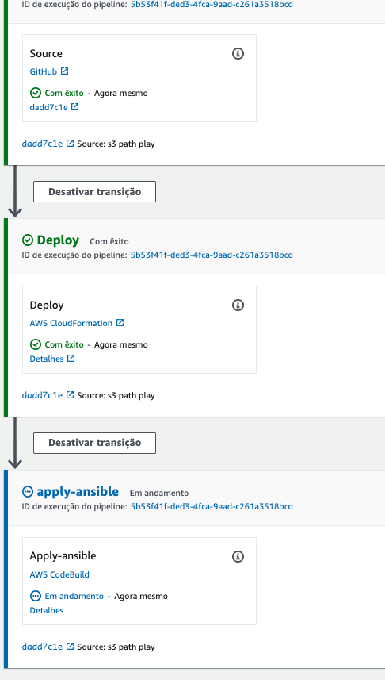
24. Clique no botão `Log finais` na lateral direita
    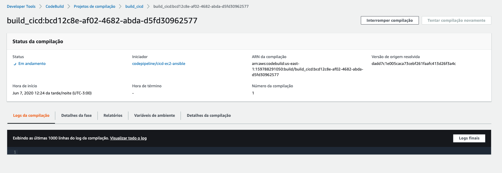
25. Nesta tela é possivel acompanhar os logs da execução do codeBuild que irá executar o Ansible na maquina, instalando o Nginx e direcionando os logs para o CloudwatchLogs.
    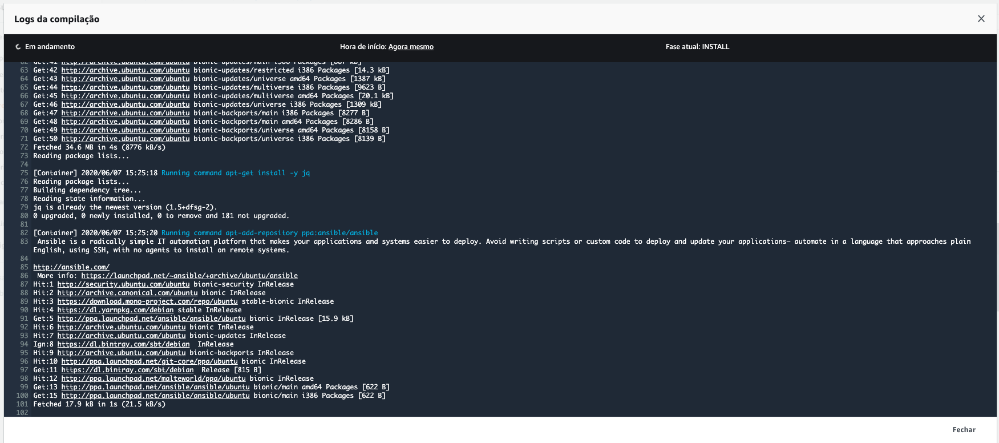
26. Após tudo terminado com sucesso você consegue verificar o resultado do NGINX acessando o ip publico da maquina criada na stack `cicd-ec2-ansible` do cloudformaiton e o os logs no cloudwatch logs pelo instance ID nesse link <https://console.aws.amazon.com/cloudwatch/home?region=us-east-1#logsV2:log-groups/log-group/nginx-access>
27. Devolta ao terminal do cloud9 execute o comando `aws cloudformation delete-stack --stack-name cicd-ec2-ansible` para deletar a stack criada.