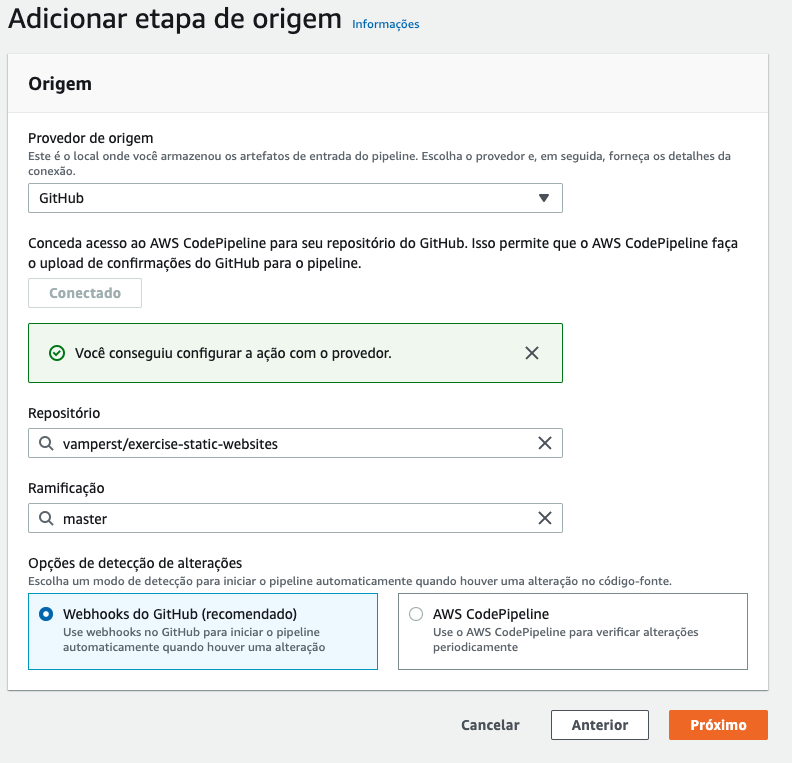
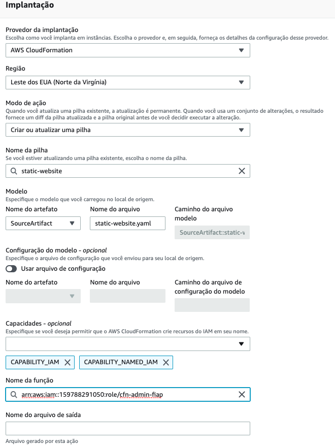
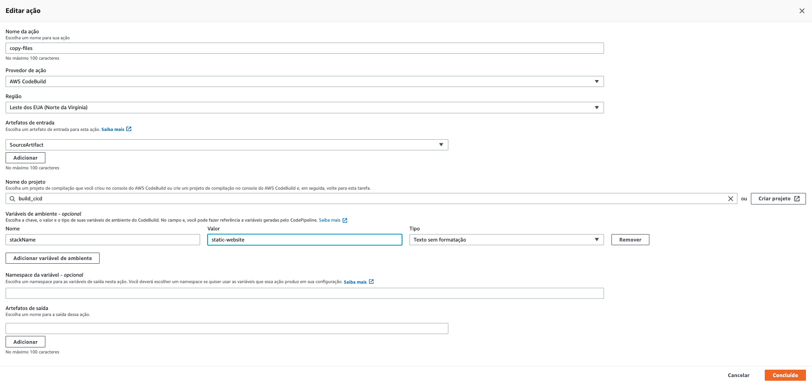
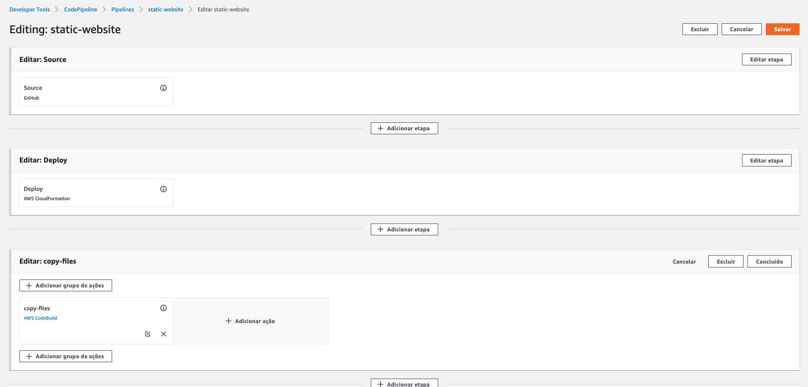
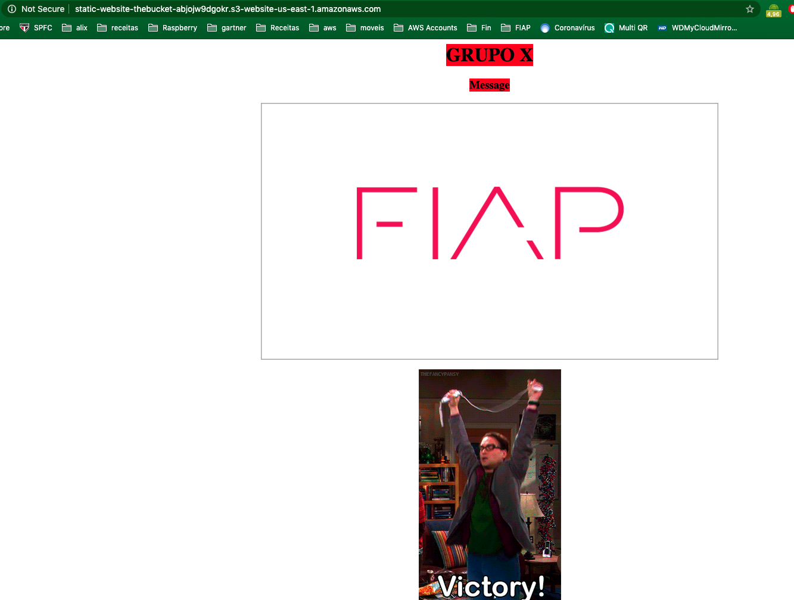
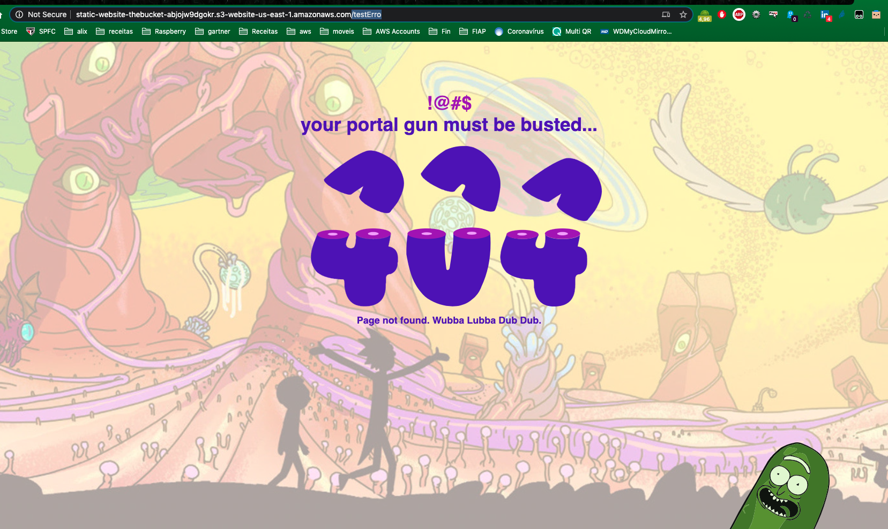

## CICD 3.4 - Cloudformation - Static-Web-Site-S3

1. Execute o comando `cd ~/environment` para voltar ao diretório principal.
2. Em outra aba do navegador faça o fork para sua conta do github do repositório <https://github.com/vamperst/exercise-static-websites>
3. De volta ao terminal do cloud9 baixe o da sua conta com os comandos abaixo. Não esqueça de adicionar seu login do github ao segundo comando:
   ``` shell
   git clone https://github.com/<SEU LOGIN NO GITHUB>/exercise-static-websites.git
   ```
4. Entre na pasta com o comando `cd exercise-static-websites`
5. Em outra aba vá para o serviço codepipeline no console AWS
6. Clique em `Criar pipeline` no canto supersiror direito
7.  o nome de `static-website` ao pipeline e clique em `Próximo`
8.  Selecione o github como sua origin e coloque o repositório `exercise-static-websites` que acabou de fazer fork como origem e no ramo master



9. Clique em `Próximo`
10. Ignore a etapa de cmopilação igual fizemos no exercício de ansible
11. Na etapa de implantação deixe como na imagem:
    
    

12. Clique em `Próximo` e `Criar pipeline`
13. Interrompa a execução automatica do pipeline clicando em `Interromper a execução` assim que voltar a tela princiapal do pipeline.
14. Vamos adicionar o CodeBuild como fizemos antes. Clique em editar no topo da página.
15.  Abaixo da etapa deploy clique em `+ Adicionar etapa` e de o nome de `copy-files`
16.  Clique em `+ Adicionar grupo de ações` da fase `copy-files`
17.  Preencha a tela com as seguintes informações:
     1. Nome da ação =  copy-files
     2. Provedor de ação = AWS CodeBuild
     3. Artefatos de entrada = SourceAtifact
     4. Nome do projeto = build_cicd (O criado no exercício anterior, não precisa de outro)
     5. Variavel de Ambiente:
        1. Nome = stackName
        2. Valor = static-website
    
    

18. Clique em `Concluído`
19. Clique em `Salvar` no canto direito superior
    
    

20. Clique em `Lançar alteração`
21. Acompanhe os estagios da mesma maneira que no exercício anterior.
22. De volta ao terminal do cloud9 utilize o comando `aws cloudformation --region us-east-1 describe-stacks --stack-name static-website --query "Stacks[0].Outputs[?OutputKey=='WebsiteURL'].OutputValue" --output text` para pegar a URL do site criado.
23. Copie a url e cole em uma aba do navegador
    
    

24. Edite a URL e no final adicioe um `/testerro` para simular um acesso de uma página não existente(404 status code).
    
    

25. No terminal do cloud9 utilize o comando `aws cloudformation delete-stack --stack-name static-website` para deletar a stack do site.