## Conteiners 4.1 - Helloworld

1. Acesse o site [play-with-docker](https://labs.play-with-docker.com)
 2. Clique para fazer o login com o Docker Hub
 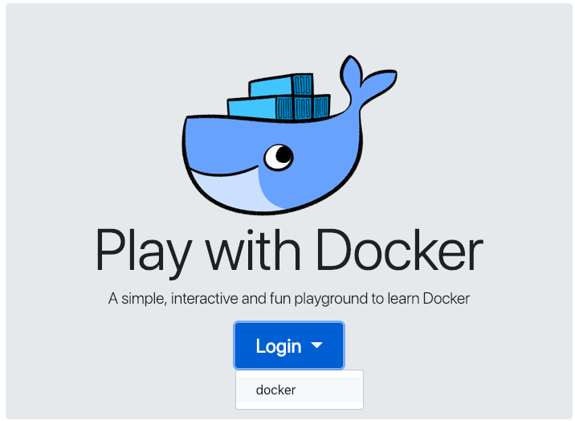
 3. Caso não tenha uma conta no Docker Hub crie em [https://hub.docker.com/signup](https://hub.docker.com/signup)
 4. Clique em `Start` após o login
 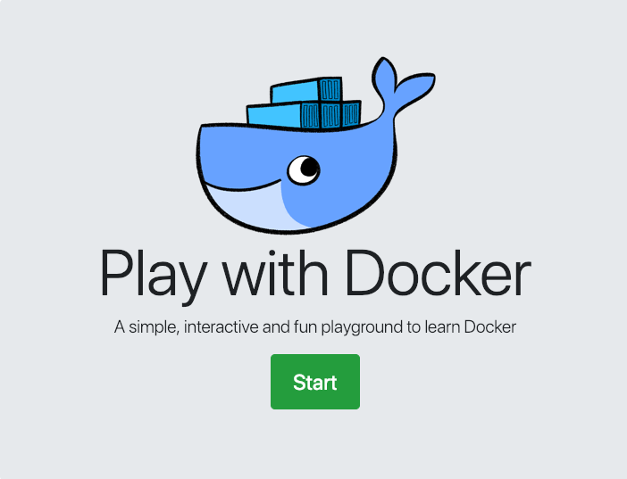
 5. Agora você terá acesso por 4 horas a maquinas de teste de docker. Clique em `add new instance` para começar a utilizar.
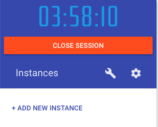
6. No terminal que abriu digite `docker run hello-world`
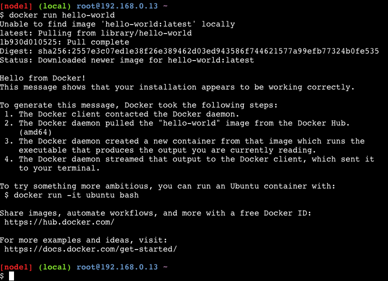
7. Suba um container ubuntu em entre nele na maneira iterativa com o comando `docker run -ti ubuntu bash`
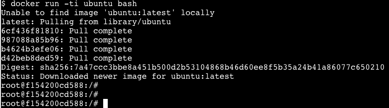
8. Para sair do container utilize o combinação de teclas `ctrl + P + Q`
9. Para ver que o container ainda esta ligado utilize o comando `docker ps`
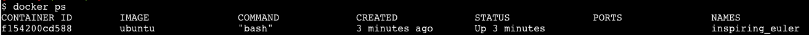
10. Note que o nome do container foi escolhido de maneira aleatória, para que isso não aconteça utilize o comando `docker run -ti --name ubuntu-teste ubuntu bash`.
11. Saia do container
12. Rode o comando  `docker container ls` para ver os containers em execução
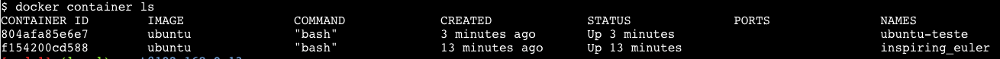
13. Utilize o comando `docker container ls -a` para ver todos os containers ativos e inativos do host
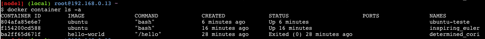
14. Utilize o comando `docker image ls` para ver todos as imagens do host
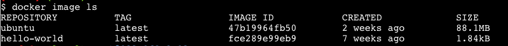
15. Agora que temos 2 containers iguais rodando, vamos para e eliminar um deles com os seguintes comandos `docker container stop ubuntu-teste` e `docker container rm ubuntu-teste`
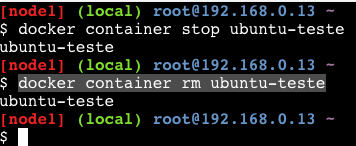
16. Agora com o comando `docker container ls -a` podemos ver que temos apenas 2 containers na maquina. Um ativo e um inativo.
17. Caso queiram forçar a remoção de um container em uso podem utilizar o comando `docker container rm -f {nome do container ubuntu rodando}`
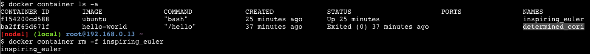
18. Agora temos apenas um container no host `docker container ls -a`

19. Delete a imagem do ubuntu do seu host com o comando `docker image rm {image_id}`, para conseguir o image_id rode o comando `docker image ls`
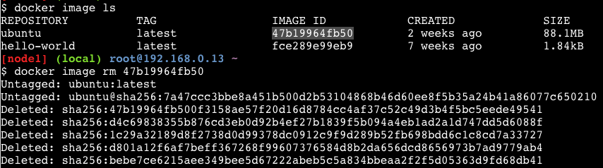
20. Execute o mesmo procedimendo para a imagem do hello-world
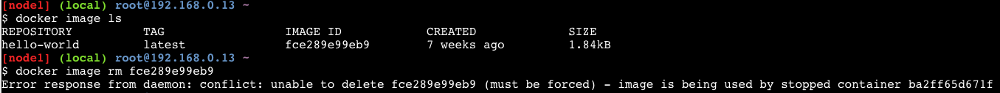
21. Para que o erro não se repita introduza o -f no comando de deletar imagem `docker image rm -f`
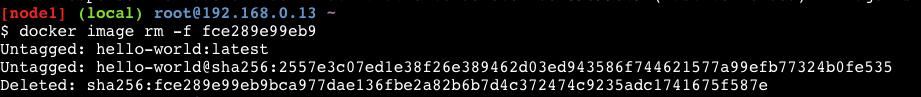
22. Para limpar o restante do host execute o comando `docker system prune -a`
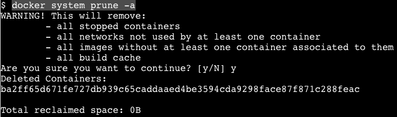
