## Conteiners 4.2 - Dockerfile

docker inspect ubuntu-teste | jq '.[] | .NetworkSettings | .Networks | .bridge | .IPAddress'| sed 's/"//g'
1. Crie uma nova sessão em uma nova instancia em [play-with-docker](https://labs.play-with-docker.com)
2. Dentro da instância execute o comando `git clone https://github.com/vamperst/pyhton-app-docker-test.git`
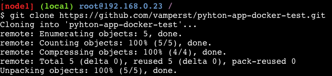
3. Entre na pasta pyhton-app-docker-test com o comando `cd pyhton-app-docker-test`
4. Faça o build da primeira imagem docker com o seguinte comando `docker build -t test/python-app:0.1 .`
5. Inicie um container com a imagem que acabou de criar: `docker run -d -p 5000:5000 --name python-app-0 test/python-app:0.1` 
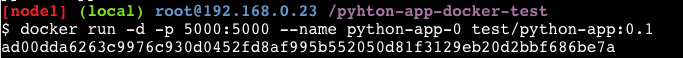
6. Ao subir o container um link com 5000 apareceu no topo da página, clique nele.
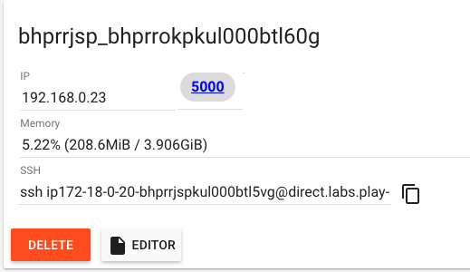
7. O 'Internal server error' já era esperado, se visualizar o arquivo app.py com o comando `cat app.py` vai notar que para funcionar o script precisar uma uma variável de ambiente chamada "number"
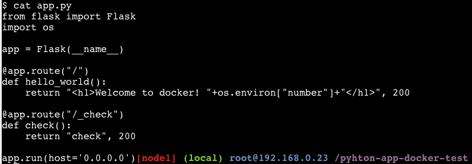
8. Remova o container criado com os comandos `docker container stop python-app-0` seguido de `docker container rm python-app-0`
9. Vamos subir um container agora com a variavel necessária utilizando o comando `docker run -d -p 5000:5000 --name python-app-0 -e number=0 test/python-app:0.1`
10. Clique novamente no link do 5000, e veja se o script funcionou

11. Vamos subir vários containers cada um com sua variável de ambiente, porta, e nome especifico. Para tal utilize o script containerUp.sh com o comando `sh containerUp.sh`
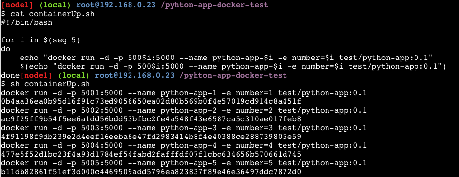
12. Teste os containers pelo link no topo da página
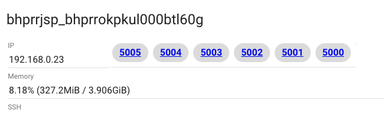
13. Desça todos os containers com o script containerDown.sh utilizando o comando `sh containerDown.sh`. Não se esqueça de eliminar o container 0 com o comando `docker container rm -f python-app-0`
14. Agora podemos ver o tamanho que as imagens ficaram com o comando `docker image ls`
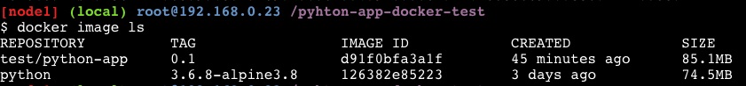
15. Note que a test/python-app:0.1 tem apenas 8.6 Mb na sua ultima layer, já que a imagem base python tem 74.5 Mb. Vamos diminuir isso para que os containers fiquem mais faceis de escalar.
16. Mude a branch do projeto para volume com o seguinte comando `git fetch && git checkout volume`
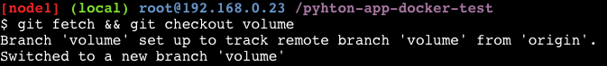
17. Note que houveram alterações importantes nos arquivos "app.py", "Dockerfile", e ".dockerignore"
O arquivo "app.py" agora aponta para '/dependencies' para procurar as dependecias do projeto;
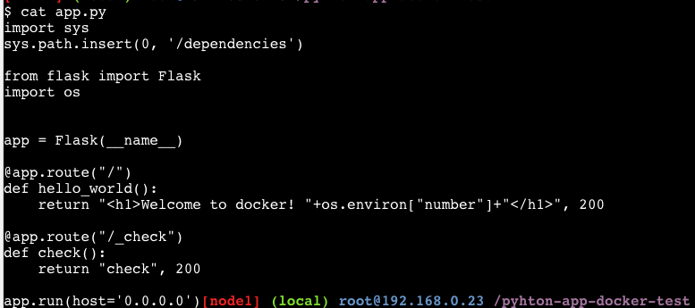
O Dockerfile não precisa mais fazer a instalação das dependencias;
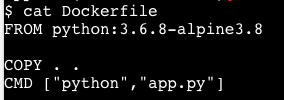
E por fim, foi adicionado a linha de ignorar o requirements.txt ao fazer o build da imagem
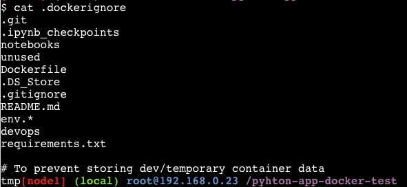
18. Faça o build da nova imagem com a tag 0.2 utilizando o seguinte comando `docker build -t test/python-app:0.2 .`
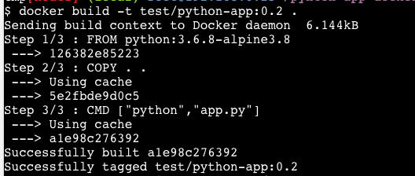
19. Agora vamos criar o volume onde ficarão as dependencias, para isso utilize o comando `docker volume create --name=dependencies01`
20. Copie o arquivo de dependencias do projeto para dentro do volume com o comando `cp requirements.txt /var/lib/docker/volumes/dependencies01/_data/`
21. Para carregar as dependencias necessárias para o volume execute um container python passando o entrypoint no run `docker run -ti -v dependencies01:/dependencies python:3.6.8 /bin/bash -c "pip3 install -r /dependencies/requirements.txt -t /dependencies"`
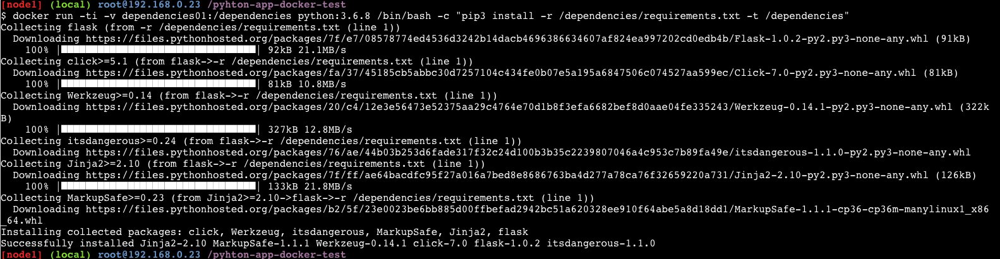
22. Confirme que todas as dependecias estão no volume conforme desejado com o comando `ls /var/lib/docker/volumes/dependencies01/_data/`
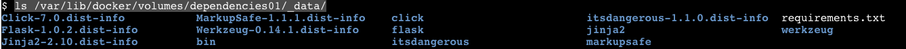
23. Suba o primeiro container apontando para o volume de dependecias com o comando `docker run -d -p 5000:5000 -v dependencies01:/dependencies --name python-app-0 -e number=0 test/python-app:0.2`
24. Teste clicando no 5000 no topo da página
25. Agora que tudo esta certo, vamos subir 5 containers apontando para o volume com o comando `sh containerUp.sh`
26. Teste os containers criados
27. Veja a diferença do tamanho do container que aponta para um volume e um com todas as dependecias dentro utilizando com o comando `docker image ls`
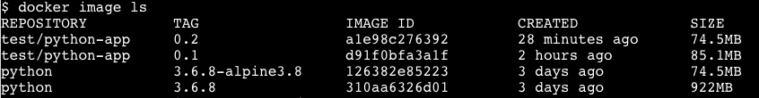
28. Outra maneira de testar os containers seria uma chamada local dos ips dos containers, para isso descubra o ip dos containers com o comando `docker inspect python-app-0`

29. Para fazer curl em todos os containers use o script curlbycontainer.sh que ira usar o path _check(Health check ). Para fitrar o json o scrit usa jq. Execute o comando `sh curlbycontainer.sh`
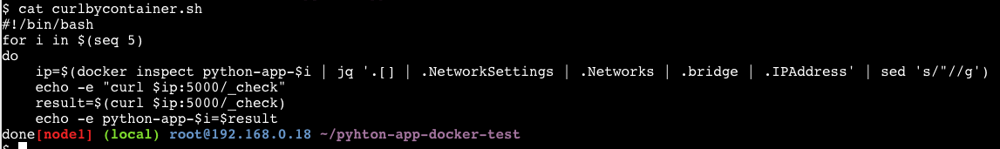
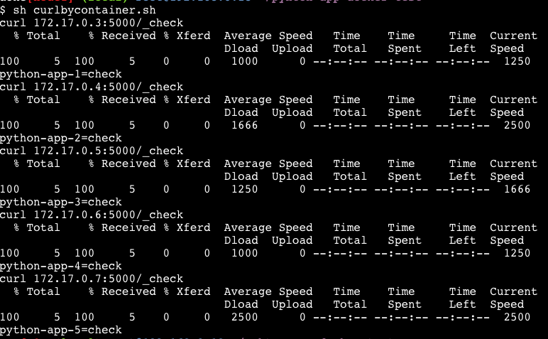
