## Conteiners 4.3 - Registry

1. Acesse via ssh a maquina "docker-1" clicando no botão ssh do console.
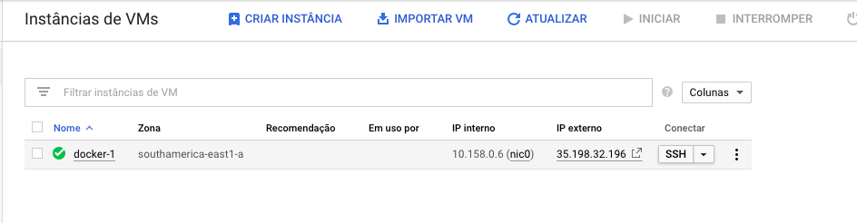
2. Dentro da instância execute o comando `git clone https://github.com/vamperst/pyhton-app-docker-test.git`, e após entre na pasta criada com o comando `cd pyhton-app-docker-test/`
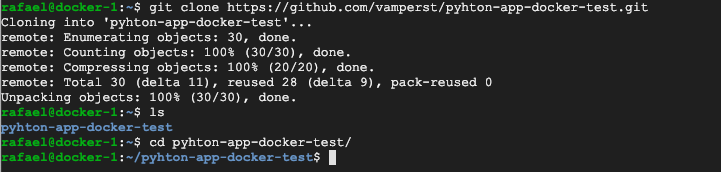
3. Mude de branch do repositório com o sequinte comando `git fetch && git checkout registry`
   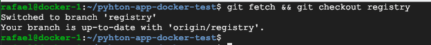
4. Execute o comando `docker build -t primeiraimagem .`
   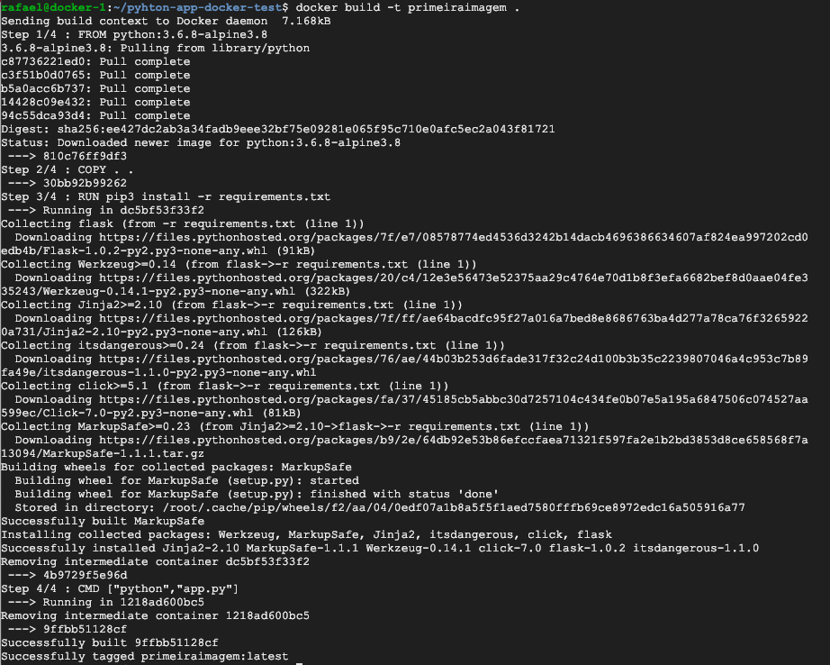
5. Execute o comando `docker tag primeiraimagem <SEU DOCKER ID>/primeiraimagem:1.0`
6. Execute o comando `docker login`, e preencha com seu docker id e senha do docker hub
    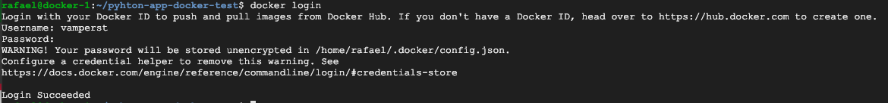
7. Agora mande a imagem para o docker hub com o seguinte comando `docker push <SEU DOCKER ID>/primeiraimagem:1.0`
   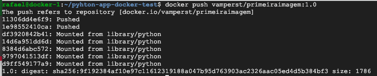
8. Agora se for no seu perfil do [Docker Hub](https://hub.docker.com/) verá que tem uma imagem chamada "primeiraimagem" com a tag 1.0
   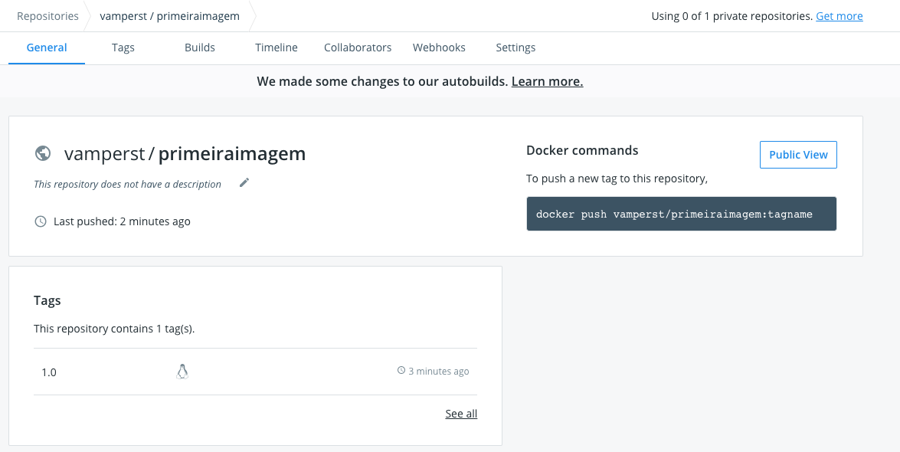
9. Apague todas as imagens com o padrão primeiraimagem com o comando `docker images -a | grep "primeiraimagem"| awk '{print $3}' | xargs docker image rm -f `
    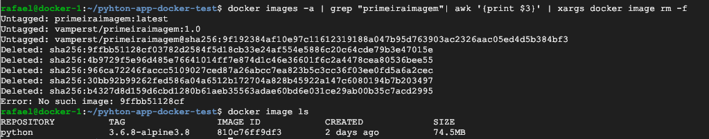
10. Baixe e execute a imagem que colocou no docker hub com o comando `docker run -d -p 5000:5000 <SEU DOCKER ID>/primeiraimagem:1.0`. Note que apenas a ultima layer foi baixada porque a imagem base necessària já esta no host usado. Isso diminui muito o quanto o docker tem que baixar a cada atualização.
    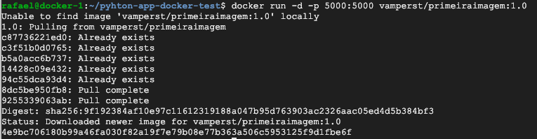
11. Pegue o ip externo no console da GCP da maquina que esta utilizando, e acrescente ":5000" para acessar o container pela navegador. ipexterno:5000
    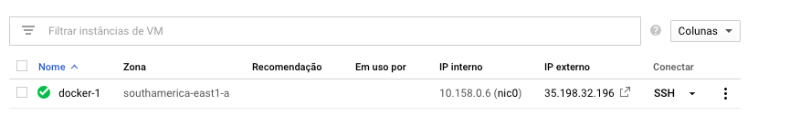
    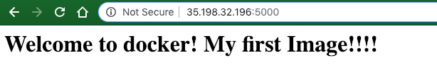
12. Pare e elimine o container que acabou de criar
    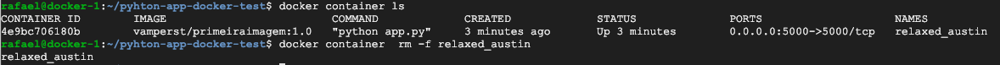
13. Para alterar o conteudo do que é exibido no navegador quando executa um container da imagem criada utilize o comando `sed -i -e 's/!!!!/!1.1/g' app.py`
    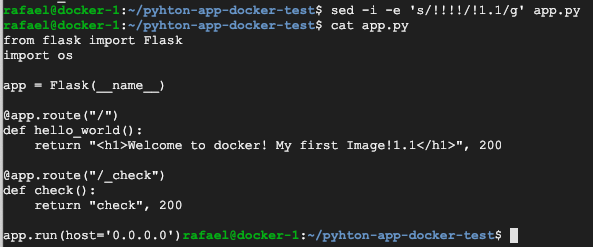
14. Execute um novo build mas agora com a tag completa no build `docker build -t <SEU DOCKER ID>/primeiraimagem:1.1 -t <SEU DOCKER ID>/primeiraimagem:latest .`
15. Agora execute os comandos `docker push vamperst/primeiraimagem:1.1` e `docker push vamperst/primeiraimagem:latest`. Note que quando você atualiza a tag latest nenhuma layer é enviada ao registry porque todos os arquivos necessàrios já estão lá, é apenas uma nova tag.
    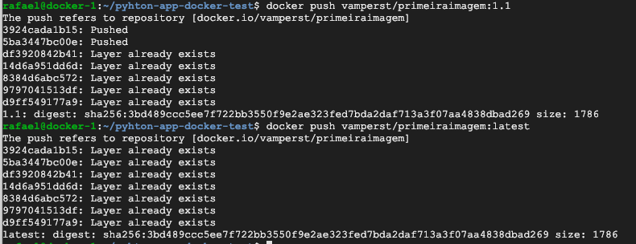
16. Olhe no docker hub as novas tags existentes
    
17. Remova novamente todas as imagens com o padrão primeiraimagem com o comando `docker images -a | grep "primeiraimagem"| awk '{print $3}' | xargs docker image rm -f`
18. Vamos agora executar um container da nova imagem utilize o comando `docker run -d -p 5000:5000 <SEU DOCKER ID>/primeiraimagem`. Note que dessa vez não passamos a tag, porem como temos uma latest no repositório o docker procura automaticamente por ela na ausencia de uma imagem local ou tag de versão remota.
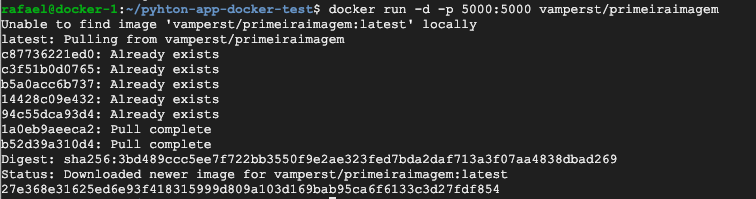
19. Teste no navegador para se certificar que funcionou
    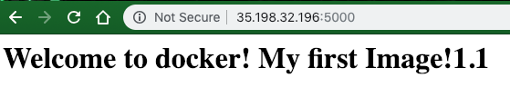
20. Pare e remova o container recem criado

