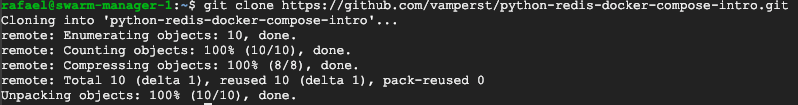
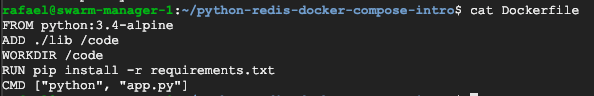
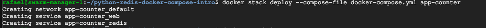
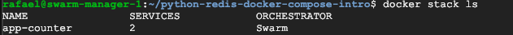
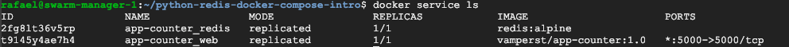
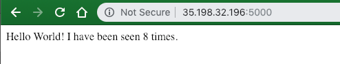
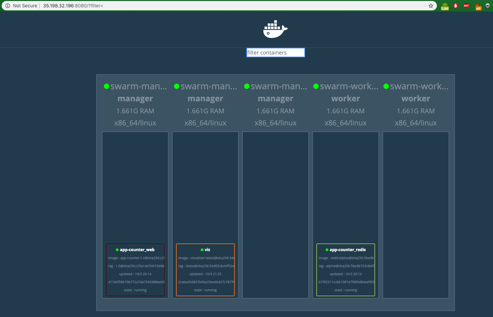
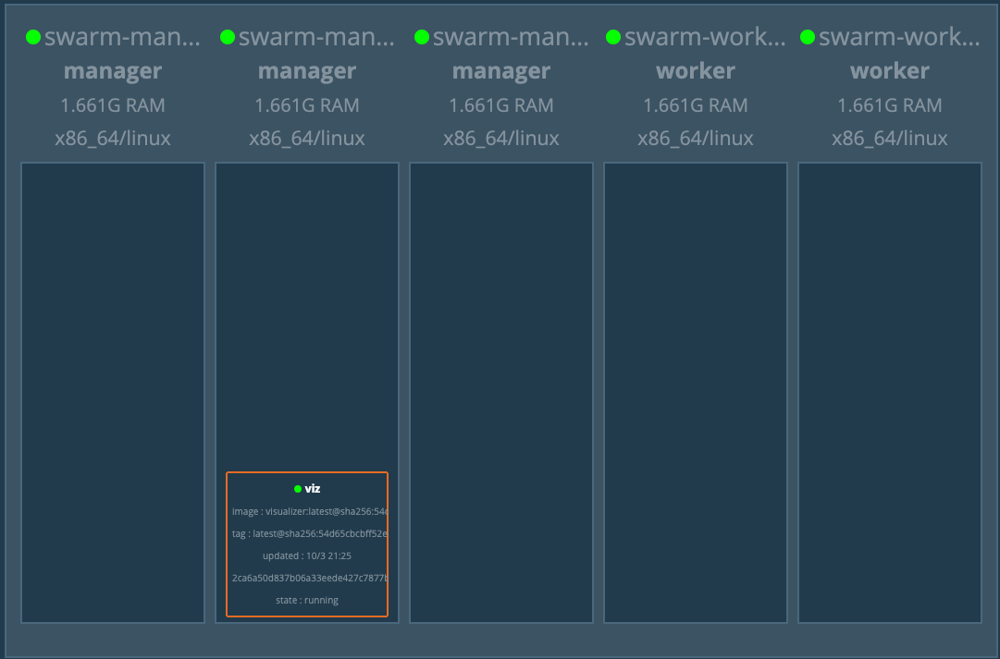

## Conteiners 4.4 - COmpose & Swarm Intro

1. Acesse via ssh o 'swarm-manager-1', e execute o comando `git clone https://github.com/vamperst/python-redis-docker-compose-intro.git`

2. Entre na pasta 'python-redis-docker-compose-intro' com o comando `cd python-redis-docker-compose-intro`
3. Execute o comando `cat Dockerfile` para ver o conteudo do Dockerfile
   
4. Execute o comando `cat docker-compose.yml` para ver o conteudo do docker-compose.yml
   
5. Esta aplicação consiste em um app que conta quantos acessos uma pagina já teve e exibe a cada acesso. Para tal utiliza um código python que esta na pasta lib, e um container de redis como banco de dados.
6. Primeiro vamos criar a imagem do aplicativo que temos Dockerfile e colocar no dockerhub. Utilize o exemplo dos exercicios anteriores caso necessário. Utilize o nome 'app-counter' na imagem.
7. Execute o comando `sed -i -e 's/app-counter/<SEU DOCKER ID>\/app-counter:<TAG>/g' docker-compose.yml ` 
8. Execute o comando `docker stack deploy --compose-file docker-compose.yml app-counter` para subir todos os serviços
   
9. Execute o comando `docker stack ls` para ver o status da stack completa
    
10. Você também pode verificar a saude dos serviços através do comando `docker service ls`
    
11. Caso todos os serviços estejam rodando conforme a imagem acima, pegue os ips externos das maquinas que esta utilizando no cluster e coloque o ":5000" em seguida para acessar pelo navegador(ip:5000). Note que você pode utilizar qualquer maquina do cluster na porta 5000 que estará batendo no mesmo serviço. Mesmo que o serviço não esteja rodando no host testado.
    
12. Para visualizar todos os containers em execução e onde estão vamos utilizar o Visualizer. Para tal execute o comando `docker service create --name=viz --publish=8080:8080/tcp  --constraint=node.role==manager --mount=type=bind,src=/var/run/docker.sock,dst=/var/run/docker.sock dockersamples/visualizer`
13. Agora pegue o ip do 'swarm-manager-1' e adicione a porta :8080 para acessar pelo navegador.
    
14. Agora vamos remover tudo do cluster. Primeiro a stack, execute o comando `docker stack rm app-counter`. Vai conseguir notar no visualizer que logo após o comando, os containers sumiram rapidamente.
    
15. Por fim remova o serviço criado para o visualizer com o comando `docker service rm viz`